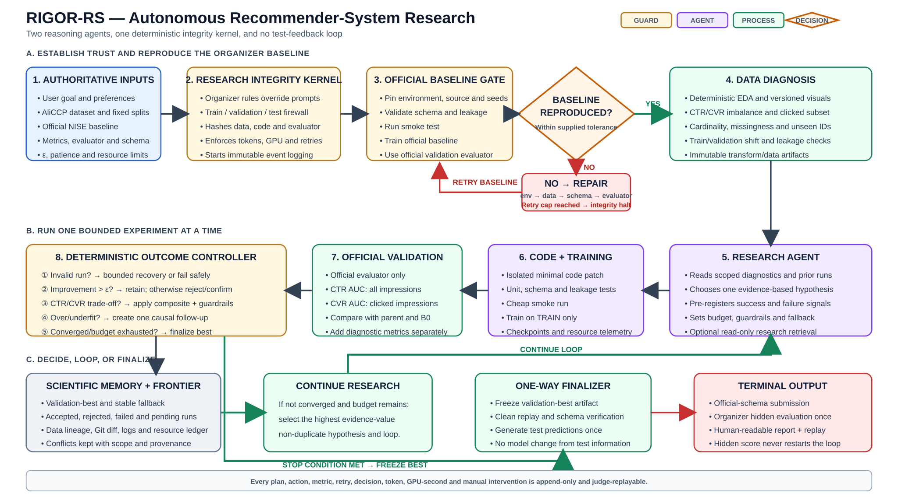
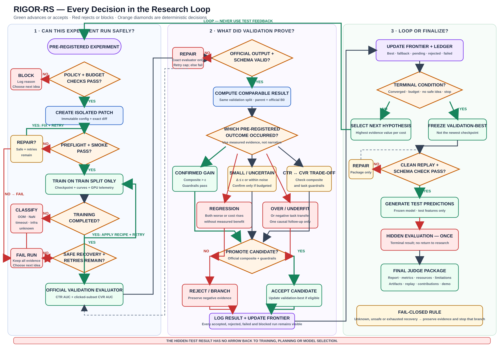

# RIGOR-RS: End-to-End Architecture

**RIGOR-RS** stands for **Reproducible, Integrity-Gated, Outcome-Registered
Research for Recommender Systems**. It is an autonomous ML research system
designed for TikTok TechJam 2026 Track #2. Its primary responsibility is to
reproduce the organizer-provided AliCCP baseline and then improve the
equal-weighted CTR/CVR validation objective through a bounded, auditable,
evidence-driven research loop.

This document is the architecture contract. It deliberately separates LLM
reasoning from deterministic control, storage, training, evaluation, and
compliance. Expected failures have explicit recovery behavior; an unknown or
unsafe condition fails closed and is recorded instead of being guessed through.

## 1. Architecture at a glance



PNG version:
[`rigor-rs-overview-readable.png`](./rigor-rs-overview-readable.png)

The detailed experiment state machine is shown below.



PNG version:
[`rigor-rs-decisions-readable.png`](./rigor-rs-decisions-readable.png)

The detailed Mermaid sources remain available for implementation-level
reference:
[`rigor-rs-overview.mmd`](./rigor-rs-overview.mmd) and
[`rigor-rs-control-loop.mmd`](./rigor-rs-control-loop.mmd).

## 2. The central design decision

RIGOR-RS uses **two recurring LLM roles and a deterministic orchestrator**:

1. **Research Agent**: interprets diagnostics, retrieves relevant evidence,
   proposes one bounded causal hypothesis, and analyzes valid results.
2. **Code and Recovery Agent**: implements a minimal real-code change and
   assists with complex semantic debugging after deterministic recovery is
   exhausted.
3. **Research Integrity Kernel**: a non-LLM state machine that enforces access,
   budgets, retries, comparable metrics, convergence, artifact selection, and
   logging.

EDA computations, plots, preprocessing execution, training, metric calculation,
schema checks, failure classification, resource monitoring, convergence, and
artifact persistence are ordinary code. LLM calls are reserved for work that
benefits from reasoning.

This replaces the original design's global `report.md` message bus and three
unbounded knowledge graphs. Markdown reports are generated views; they are never
authoritative storage.

## 3. Non-negotiable invariants

These invariants are checked by code and cannot be overridden by a user prompt
or an agent:

1. AliCCP is the required primary benchmark. KuaiRand remains disabled until
   AliCCP is submission-ready.
2. Only challenge-permitted datasets may contribute training examples or labels.
3. Organizer split definitions, label definitions, official evaluator, output
   schema, and official baseline have higher authority than user preferences or
   agent suggestions.
4. The organizer-provided official baseline must be reproduced before any
   improvement claim or novel experiment is allowed.
5. Model fitting uses the training split. Validation labels are used only
   through permitted evaluation feedback.
6. Test labels are absent, sealed, or denied to every development component.
   Test performance can never select, reject, repair, or restart an experiment.
7. The official evaluator is the source of truth. A substitute metric may be
   used only as a diagnostic and cannot validate an improvement.
8. AliCCP reports CTR AUC on all impressions and CVR AUC on clicked impressions.
   Both contribute equally to the primary composite delta.
9. Every experiment has a unique immutable ID, one primary hypothesis, an
   explicit parent, a pre-written plan, a code diff, exact commands, a budget,
   and a fallback.
10. Every success, regression, crash, retry, repair, timeout, OOM, and manual
    intervention remains in append-only history.
11. Organizer-controlled baseline scores, epsilon, patience, compute limits,
    wall-clock limits, seeds, evaluator commands, and schemas are loaded from
    versioned challenge configuration rather than hard-coded.
12. The validation-best comparable artifact, not the latest artifact, is
    finalized at convergence or budget exhaustion.
13. The final hidden-test evaluation is terminal and happens once through the
    organizer process.
14. The system remains inspectable and its completed runs remain replayable when
    the LLM or network is unavailable.

## 4. Authority and trust model

### 4.1 Authority precedence

When instructions conflict, the kernel uses this order:

1. Newest organizer Starter Kit, evaluator, schema, or explicit instruction.
2. Versioned challenge configuration derived from organizer material.
3. Official baseline repository and pinned baseline configuration.
4. Repository policy and data-integrity tests.
5. User preferences that do not conflict with levels 1-4.
6. Retrieved papers, repositories, and model cards.
7. Agent hypotheses and interpretations.

The conflict and its resolution are logged. Lower-authority content is never
silently substituted for organizer truth.

### 4.2 Split-taint labels

Every dataset and derived artifact carries exactly one or more access labels:

| Label                 | Permitted use                                                          |
| --------------------- | ---------------------------------------------------------------------- |
| `TRAIN_FEATURES`      | Profiling, transform fitting, model fitting, diagnostics               |
| `TRAIN_LABELS`        | Model fitting and training diagnostics                                 |
| `VALIDATION_FEATURES` | Applying train-fitted transforms and generating validation predictions |
| `VALIDATION_FEEDBACK` | Official validation evaluation and research decisions                  |
| `TEST_FEATURES_ONLY`  | Final prediction generation and schema checks after finalization       |
| `TEST_LABELS_LOCKED`  | No development component has read capability                           |

Lineage propagates the strongest taint. For example, an artifact derived from
validation labels is `VALIDATION_FEEDBACK` and cannot enter training. A training
matrix containing any test-tainted parent is rejected before execution.

### 4.3 Capabilities

Components receive the minimum capabilities they need:

| Component          | Data access                                     | Code access                   | Network access                  | Mutation rights               |
| ------------------ | ----------------------------------------------- | ----------------------------- | ------------------------------- | ----------------------------- |
| Profiler           | Train and permitted validation                  | Read profiling modules        | None required                   | New diagnostic artifacts only |
| Research Agent     | Summaries and scoped run evidence               | Relevant read-only files      | Evidence gateway only           | Experiment contract only      |
| Code Agent         | Artifact schemas, selected source files, errors | Isolated experiment workspace | Disabled by default             | Current experiment patch only |
| Trainer            | Train artifacts                                 | Pinned experiment revision    | Disabled                        | Checkpoints and logs only     |
| Evaluator          | Validation labels and predictions               | Official evaluator only       | Disabled                        | Metric receipt only           |
| Finalizer          | Validation-best artifact and test features      | Packaging code                | Submission endpoint if required | Final package only            |
| UI/report renderer | Redacted event and artifact metadata            | None                          | None                            | Generated views only          |

External text and repository content are untrusted. Prompt injection found in
papers, issues, README files, or source comments cannot grant capabilities or
change the task contract.

## 5. Input contract

The first system action converts inputs into a typed, immutable challenge
contract. User NLP is parsed into **preferences**, while organizer fields become
**invariants**.

Required configuration responsibilities:

```yaml
challenge:
  id: organizer_supplied_identifier
  benchmark: aliccp
  organizer_material_version: supplied_value

data:
  raw_uri: supplied_path_or_object_uri
  dataset_version: supplied_value
  expected_checksums: supplied_manifest
  split_definition: supplied_definition
  train_selector: supplied_selector
  validation_selector: supplied_selector
  test_selector: supplied_selector
  labels: supplied_label_contract

baseline:
  identifier: organizer_official_identifier
  source_uri: organizer_supplied_repository
  source_revision: pinned_commit_or_release
  environment: pinned_environment_artifact
  train_command: exact_command
  evaluate_command: exact_official_command
  expected_scores: organizer_supplied_or_null
  reproduction_tolerance: organizer_supplied_or_null

evaluation:
  evaluator_uri: organizer_supplied_path
  evaluator_hash: computed_hash
  metrics:
    - ctr_auc_all_impressions
    - cvr_auc_clicked_impressions
  composite_rule: organizer_supplied_rule
  submission_schema: organizer_supplied_schema

convergence:
  epsilon: organizer_supplied_value
  patience: organizer_supplied_value
  counting_policy: organizer_supplied_policy

budget:
  wall_clock_seconds: organizer_supplied_value
  gpu_hours: organizer_supplied_value
  llm_input_tokens: organizer_supplied_value
  llm_output_tokens: organizer_supplied_value
  max_experiments: organizer_supplied_value
  max_retries_per_failure: configured_bounded_value

user_preferences:
  objective_notes: permitted_nlp_summary
  excluded_features: permitted_list
  resource_preference: permitted_value
```

If a required organizer field is unresolved, the relevant gate blocks rather
than inventing a value.

## 6. Storage and scientific memory

### 6.1 Dataset and artifacts

Use this storage policy:

- Single workstation: immutable local raw data and derived artifacts on fast
  local storage.
- Cloud or multiple workers: S3/MinIO as canonical object storage with a
  content-addressed local NVMe cache.
- PostgreSQL is for concurrent metadata, not bulk datasets or model tensors.
- SQLite is sufficient for a judge-friendly single-machine deployment.
- Restricted raw data is never committed to Git.
- Derived tables are stored as immutable Parquet shards or the exact
  baseline-native format where compatibility requires it.
- Pickled dataframes are not an interchange contract.

Every dataframe-like output becomes an **artifact reference node**, not data
inside a graph:

```yaml
artifact_id: sha256:<content-hash>
kind: raw_dataset | derived_table | checkpoint | predictions | plot | log
uri: artifacts-or-object-store-uri
parents: [sha256:<parent-hash>]
dataset_version: value
split_taint: [TRAIN_FEATURES]
schema_fingerprint: sha256:<schema-hash>
row_count: integer
column_manifest: path
transform_code_hash: sha256:<code-hash>
config_hash: sha256:<config-hash>
created_by_run: run_id
created_at: timestamp
```

### 6.2 One ledger, not three general-purpose knowledge graphs

The memory layer has four specializations:

1. **Run ledger**: structured experiment plans, metrics, decisions, resource
   use, failures, and frontier state.
2. **Artifact/lineage DAG**: immutable nodes and `DERIVED_FROM`, `TRAINED_ON`,
   `EVALUATED_BY`, and `GENERATED` edges.
3. **Git provenance**: code commits and exact patch files.
4. **Scoped claim graph**: contextual scientific claims linked to run evidence.

Suggested relational tables:

```text
sessions
runs
run_events
experiment_contracts
metrics
resource_usage
artifacts
lineage_edges
failures
recoveries
claims
claim_evidence
frontier_entries
manual_interventions
finalization_receipts
```

The graph is a query view over relational edges unless graph-database path
queries become demonstrably necessary. This keeps clean-machine setup simple.

### 6.3 Conflict-safe claims

A claim is never a free-floating fact. It includes:

```yaml
claim_id: immutable_id
type: observation | interpretation | hypothesis | organizer_rule
statement: bounded_statement
scope:
  benchmark: aliccp
  dataset_hash: hash
  split_definition_hash: hash
  pipeline_hash: hash
  model_family: value
  config_hash: hash
  evaluator_hash: hash
  seed_set: [values]
evidence_run_ids: [run_ids]
authority: organizer | measured | replicated | literature | agent
confidence: numeric_or_categorical
status: supported | contradicted | disputed | superseded
relations:
  supports: [claim_ids]
  contradicts: [claim_ids]
  supersedes: [claim_ids]
```

Resolution rules:

1. Compare claims only when their scopes are compatible.
2. Organizer rules beat all other claims.
3. Official-evaluator measurements beat interpretations.
4. Replicated evidence beats a single run.
5. A newer result does not automatically beat an older result if configuration
   differs.
6. Irreconcilable claims remain disputed and are shown to the planner together.
7. Numeric observations are aggregated deterministically; an LLM never decides
   which metric is true.

## 7. Agent and service responsibilities

### 7.1 Research Agent

Inputs:

- Task contract and protected invariants.
- Current deterministic data profile.
- Current best candidate and stable fallback.
- Top-k comparable successful, rejected, and failed runs.
- Resource balance and convergence state.
- Relevant scoped claims.
- Optional cached external evidence.

Outputs:

- One causal hypothesis.
- Evidence and rationale.
- One primary pipeline change.
- Predicted metric and diagnostic directions.
- Falsifiers and ambiguous-outcome branches.
- Success criteria and task guardrails.
- Estimated cost and safe fallback.
- Next-hypothesis suggestions conditional on each outcome.

It does not execute arbitrary code, mutate history, read bulk data rows, see
test labels, or directly select the final artifact.

### 7.2 Code and Recovery Agent

Inputs:

- Approved experiment contract.
- Minimal relevant source tree.
- Parent commit and configuration.
- Data and evaluator interfaces.
- Failing tests or error evidence when applicable.

Outputs:

- Minimal isolated patch.
- Targeted tests.
- Immutable configuration.
- Dependency changes, if any, with license and version evidence.
- Diagnosis and repair patch for complex failures.

It cannot modify the official evaluator, split definition, baseline record,
prior run history, resource receipts, or finalization decision.

### 7.3 Deterministic services

| Service             | Responsibility                                                             |
| ------------------- | -------------------------------------------------------------------------- |
| Task interpreter    | Parse organizer configuration and user preferences into a typed contract   |
| Authority resolver  | Reject conflicts with organizer material                                   |
| Integrity kernel    | Enforce taint, capabilities, lifecycle, budgets, retries, and finalization |
| Profiler            | Produce repeatable data statistics and plots                               |
| Context compiler    | Retrieve only relevant evidence within a token budget                      |
| Experiment compiler | Validate and serialize the pre-registered experiment contract              |
| Workspace manager   | Create isolated revisions and preserve diffs                               |
| Trainer             | Launch deterministic training and checkpointing                            |
| Evaluator wrapper   | Invoke the exact official evaluator and produce a signed metric receipt    |
| Resource monitor    | Record tokens, GPU-hours, wall time, memory, process status, and retries   |
| Outcome controller  | Compare results and execute the pre-registered branch                      |
| Recovery controller | Classify known failures and apply bounded safe recipes                     |
| Ledger writer       | Append immutable events and prevent history rewrites                       |
| Finalizer           | Freeze validation-best artifact and create the submission package          |
| Report renderer     | Generate Markdown, UI views, and demo replay from structured records       |

## 8. End-to-end lifecycle

### Phase 0: Boot and reproducibility capture

1. Generate a session ID and start an append-only event stream.
2. Capture operating system, CPU, RAM, accelerator model, driver, CUDA, runtime,
   dependency lockfile, container image digest, repository revision, and all
   seeds.
3. Initialize token, GPU-hour, wall-clock, storage, retry, and intervention
   counters before the first LLM call or GPU action.
4. Validate that all commands use configured paths rather than undocumented
   machine-local paths.
5. Hash organizer configuration, evaluator, baseline revision, schema, and
   dataset manifest.
6. Deny training if any integrity hash unexpectedly changes during a session.

### Phase 1: Input validation and split firewall

1. Parse user intent as a preference document.
2. Resolve it against organizer invariants.
3. Reject requests for external training data, hidden labels, altered splits,
   unofficial scoring, or repeated hidden-test evaluation.
4. Register raw artifacts and split-taint labels.
5. Confirm checksums, file presence, readability, row identity, split
   exclusivity, expected temporal boundaries, label definitions, and submission
   identifiers.
6. Validate that train-fitted transforms cannot consume validation or test
   feedback.
7. Preserve a read-only raw-data reference.

### Phase 2: Official baseline reproduction gate

1. Pin the organizer/NISE baseline revision and exact environment.
2. Record the baseline plan before execution.
3. Run contract tests and a cheap smoke run.
4. Train the official baseline using the fixed train split.
5. Evaluate it using the official validation evaluator.
6. Save metrics, commands, seeds, logs, resources, predictions, checkpoint,
   configuration, evaluator hash, and code hash.
7. Compare observed baseline results with organizer-provided expectations using
   the organizer-provided tolerance.
8. If the baseline does not reproduce, diagnose in this order:
   - environment and dependency mismatch;
   - wrong dataset version or path;
   - split mismatch or overlap;
   - schema or column-order mismatch;
   - label interpretation mismatch;
   - preprocessing mismatch;
   - seed/nondeterminism mismatch;
   - evaluator or output-schema mismatch.
9. Retry only within the configured recovery limit.
10. If unresolved, issue an integrity halt. Novel experiments may not begin and
    no improvement may be claimed.
11. On success, register the baseline as `B0` and the stable fallback.

### Phase 3: Deterministic diagnosis and safe preprocessing

The profiler computes, where applicable:

- Counts by split and clicked subset.
- CTR and clicked-subset conversion prevalence.
- Null, malformed, duplicate, constant, and near-constant fields.
- Feature data types, cardinality, frequency tails, sparsity, and unseen-ID
  rates.
- Train/validation feature and label drift without accessing hidden test labels.
- User, item, category, and interaction coverage.
- Temporal order and leakage risks.
- Baseline training/validation curves, per-task losses, convergence behavior,
  throughput, peak GPU memory, and wall time.
- Calibration, PR-AUC, log loss, subgroup behavior, and cold/unseen-ID
  diagnostics where meaningful.

Cleaning and feature transforms follow these rules:

1. The reproduced baseline branch remains immutable.
2. A new transform is an experiment, not an invisible mutation.
3. Protected identifiers, labels, split keys, and submission keys cannot be
   removed because of a user preference.
4. Imputers, vocabularies, rare-category thresholds, scalers, encoders, and
   feature statistics are fit on train only.
5. Validation and test features receive the frozen train-fitted transformation.
6. Every materialized table has a parent lineage, schema fingerprint, row count,
   and transform code hash.
7. Dataframe rows never enter an LLM prompt; only bounded statistics, samples
   allowed by policy, and artifact references do.
8. The profiler reruns incrementally only when an upstream data or transform
   artifact changes.

### Phase 4: Context compilation and experiment selection

The context compiler retrieves:

- Current task contract.
- Current validation-best parent and stable fallback.
- Latest relevant diagnostics.
- Closest comparable accepted, rejected, failed, and recovered experiments.
- Prior claims sharing dataset, pipeline, model, and evaluator scope.
- Remaining token/GPU/wall-clock budget.
- Duplicate signatures of already attempted configurations.

It does not pass the entire accumulated report to every agent. Retrieval count,
character count, token count, and source IDs are logged.

The planner ranks candidates by evidence value rather than running a blind grid.
A conceptual ranking function is:

```text
utility(h) = expected_information_or_positive_delta(h)
             × probability_of_valid_execution(h)
             × novelty_value(h)
             -------------------------------------------------
             expected_GPU_hours(h)
             + token_cost_weight × expected_tokens(h)
             + risk_weight × implementation_risk(h)
             + complexity_weight × maintenance_cost(h)
```

Weights are configured and the ranking is advisory; the organizer metric remains
the optimization objective. Cold-start estimates are explicitly marked as priors
and updated from measured runs.

Candidate families are selected only when diagnostics support them. Examples
include leakage-safe categorical handling, meaningful crosses,
optimizer/regularization changes, funnel-consistent auxiliary objectives, ESMM,
task-sharing changes, MMoE/PLE for measured negative transfer, and interaction
models such as DeepFM/DCN. A fashionable architecture is not itself evidence.

### Phase 5: Pre-registered counterfactual experiment contract

Before code or training begins, the system writes an immutable contract:

```yaml
experiment_id: immutable_id
parent_run_id: baseline_or_prior_run
primary_hypothesis: specific_causal_statement
evidence:
  run_ids: []
  diagnostic_artifacts: []
  external_sources: []
planned_change:
  component: data | feature | model | objective | training | evaluation_wrapper
  description: one_bounded_change
  allowed_files: []
  prohibited_files: [official_evaluator, split_definition, prior_history]
expected_outcomes:
  success:
    primary_metric_direction: configured_expectation
    diagnostic_direction: configured_expectation
    action: retain_or_confirm
  task_tradeoff:
    signature: ctr_up_cvr_down_or_reverse
    action: investigate_task_interference
  overfit:
    signature: train_improves_validation_degrades
    action: reject_and_branch_regularization
  underfit:
    signature: train_and_validation_flat_or_weak
    action: reject_and_branch_capacity_or_optimization
  no_signal:
    signature: delta_not_greater_than_epsilon
    action: reject_or_confirm_if_uncertain
falsifiers: []
success_criterion:
  comparator: parent_and_official_baseline
  epsilon: from_challenge_config
  task_guardrails: from_challenge_config_or_null
confirmation_policy: configured_seed_or_uncertainty_rule
budget:
  max_gpu_hours: value
  max_wall_seconds: value
  max_input_tokens: value
  max_output_tokens: value
fallback:
  run_id: stable_parent
  recovery_limit: value
```

This prevents post-hoc storytelling: the agent commits to what each outcome
means before seeing the outcome.

### Phase 6: Code generation and preflight

1. Create an isolated branch/worktree/container from the parent revision.
2. Apply the smallest patch needed for the contract.
3. Reject changes outside the declared file scope unless the plan is superseded
   by a new logged contract.
4. Save the exact diff before training.
5. Run formatting/static checks where configured.
6. Run unit tests for the touched component.
7. Run data-schema, split-taint, leakage, evaluator, and submission-schema
   contracts.
8. Run metamorphic metric tests, including row-order invariance and
   clicked-subset CVR behavior.
9. Run a cheap smoke experiment on a train-only sample when structurally risky.
10. Smoke metrics validate mechanics only; they cannot be reported as a final
    improvement.
11. Estimate whether the full run fits remaining budget.
12. Enter full training only when every gate passes.

### Phase 7: Training and official validation

1. Set deterministic seeds and record effective settings.
2. Load train artifacts only for optimization.
3. Record batch size, effective batch size, gradient accumulation, precision,
   optimizer, scheduler, learning rate, task-loss weights, epochs,
   early-stopping logic, and checkpoint cadence.
4. Stream stdout/stderr and structured telemetry.
5. Save recoverable checkpoints atomically with hashes.
6. Record GPU device utilization, peak memory, elapsed accelerator time, wall
   time, and dataloader throughput.
7. Generate validation predictions with the frozen preprocessing pipeline.
8. Validate prediction count, identifiers, order/key semantics, types,
   missingness, and value domains.
9. Invoke the exact organizer evaluator.
10. Store raw evaluator output and a parsed metric receipt containing evaluator
    and prediction hashes.
11. Compute diagnostics without replacing official metrics.

### Phase 8: Result interpretation and frontier update

Let `R[m,s]` be the current run's official score for metric `m` on split `s`,
and `B[m,s]` the reproduced official baseline score on the same split.

For AliCCP validation:

```text
delta_ctr = R[CTR_AUC, validation] - B[CTR_AUC, validation]
delta_cvr = R[CVR_AUC_clicked, validation] - B[CVR_AUC_clicked, validation]
composite_delta_vs_baseline = (delta_ctr + delta_cvr) / 2
```

The same formula is computed against the selected parent. Absolute difference,
not relative percentage, is used.

Diagnostics may include PR-AUC, log loss, calibration error, task losses,
training/validation gap, learning curves, subgroup behavior, unseen-ID behavior,
runtime, memory, and task-gradient conflict. Precision and recall are
threshold-dependent diagnostics and are never confused with the primary AUC
objective.

Outcome handling:

| Observed case                                                            | Interpretation                                 | Controller action                                                                                   |
| ------------------------------------------------------------------------ | ---------------------------------------------- | --------------------------------------------------------------------------------------------------- |
| Evaluator output invalid                                                 | No scientific result exists                    | Recover evaluator/schema issue or fail the run                                                      |
| Both primary metrics improve and composite exceeds epsilon               | Strong candidate                               | Confirm if policy requires, then retain                                                             |
| One metric improves and the other is unchanged                           | Potential useful candidate                     | Apply composite and configured guardrails; confirm near threshold                                   |
| One metric improves and the other declines                               | Possible task interference                     | Preserve result; inspect composite, task losses, and pre-registered guardrails; branch if justified |
| Composite improvement is positive but not greater than epsilon           | No convergence-counted improvement             | Treat as no improvement or confirm only if uncertainty policy permits                               |
| Delta is within seed/evaluation noise                                    | Unconfirmed                                    | Run predeclared confirmation if budget permits; otherwise reject as unconfirmed                     |
| Both metrics regress                                                     | Falsified hypothesis                           | Reject and retrieve a different causal branch                                                       |
| Training improves while validation degrades                              | Overfit signature, not proof of a single cause | Reject parent promotion; branch one regularization/data/capacity hypothesis                         |
| Training and validation are both weak or flat                            | Underfit/optimization/data signature           | Branch one capacity, representation, loss, or optimization hypothesis                               |
| CTR improves while CVR loss/gradient behavior worsens, or reverse        | Negative transfer evidence                     | Test loss balance, separation, expert routing, or funnel consistency one at a time                  |
| Runtime/memory cost rises without measured benefit                       | Complexity failure                             | Reject even if code works                                                                           |
| Result duplicates an equivalent prior configuration                      | No new evidence                                | Skip before training and log duplicate relationship                                                 |
| Result is valid but not comparable because evaluator/data/config changed | Different experimental scope                   | Do not place on the same frontier; repair comparability or open a separate branch                   |

The frontier contains:

- `validation_best`: best confirmed comparable validation artifact.
- `stable_fallback`: last known reproducible valid parent.
- `pending_confirmation`: promising but noisy candidates.
- `rejected`: valid negative experiments.
- `failed`: invalid executions and recovery evidence.
- `blocked`: policy, integrity, duplication, or budget violations.
- `next_candidates`: ranked bounded hypotheses.

### Phase 9: Convergence and stop logic

After every valid comparable result, the deterministic controller updates the
organizer-defined improvement counter. It stops when any configured terminal
condition becomes true:

1. Validation improvement does not exceed organizer epsilon for organizer
   patience `N` according to the organizer counting policy.
2. GPU-hour budget is exhausted or the next safe experiment cannot fit it.
3. Wall-clock budget is exhausted or the next safe experiment cannot fit it.
4. LLM token budget is exhausted; no new planning calls are allowed.
5. Maximum experiment count is reached.
6. No safe, non-duplicate, evidence-supported hypothesis remains.
7. Baseline integrity cannot be established.
8. An explicit authorized stop is issued.

Failed runs and recovery attempts count toward resource use even if the
organizer convergence policy excludes them from patience. The architecture does
not assume that detail; it reads it from configuration.

If no novel experiment beats the official baseline, the final artifact remains
the reproduced official baseline or the validation-best valid candidate as
dictated by the supplied final-selection rule. The system reports the lack of
improvement honestly.

### Phase 10: One-way finalization

1. Lock the research frontier.
2. Select the confirmed validation-best comparable artifact.
3. Write a finalization receipt containing run ID, parent, dataset, transform,
   code, config, checkpoint, evaluator, prediction, and environment hashes.
4. Replay the winning run or its required deterministic reproduction path in a
   clean environment.
5. Repair packaging or reproducibility defects only. Do not change the model
   because of test information.
6. Apply the frozen train-fitted pipeline to test features.
7. Generate predictions in the official schema.
8. Validate schema and identifiers without accessing test labels.
9. Produce the submission artifact.
10. Submit once for organizer hidden evaluation.
11. Treat the hidden result as terminal. It cannot cause another experiment.
12. Render final reports and resource totals from the immutable ledger.

Unless the organizer explicitly permits it, RIGOR-RS does not retrain on train
plus validation after model selection; it retains the validation-best artifact
as required.

## 9. Complete recovery and fail-closed matrix

Every recovery has a configured attempt limit, consumes budget, preserves the
original failure, and either returns to the nearest safe preflight stage or
terminates the affected run.

| Failure class                         | Detection                            | Bounded recovery                                                                             | Terminal behavior                                        |
| ------------------------------------- | ------------------------------------ | -------------------------------------------------------------------------------------------- | -------------------------------------------------------- |
| Missing organizer field               | Contract schema validation           | Load explicit supplied config                                                                | Block affected phase; never invent value                 |
| User request conflicts with rules     | Authority resolver                   | Remove only the conflicting preference and record it                                         | Block if task cannot proceed safely                      |
| Dataset missing/unreadable            | Manifest/open check                  | Retry configured path or bounded transient I/O retry                                         | Integrity halt                                           |
| Dataset checksum mismatch             | Content hash                         | Restore verified artifact                                                                    | Integrity halt if no verified copy                       |
| Split overlap/leakage                 | Row/key/time-boundary tests          | Correct configuration or validated adapter                                                   | Integrity halt if ambiguity remains                      |
| Test-label access attempt             | Capability denial and taint check    | None; revoke action and record security event                                                | Block run; preserve incident                             |
| Schema mismatch                       | Expected/actual schema diff          | Validated adapter or correct config                                                          | Fail run if semantic mapping is uncertain                |
| Missing/malformed values              | Data contracts                       | Declared train-fitted cleaning transform                                                     | Fail affected experiment if unresolved                   |
| Empty clicked subset or one-class AUC | Label/subset validation              | Correct split/config if wrong; otherwise mark metric undefined                               | Result invalid and non-comparable                        |
| Baseline dependency mismatch          | Environment diff                     | Rebuild pinned environment                                                                   | Baseline integrity halt after retries                    |
| CUDA/driver incompatibility           | Runtime preflight                    | Compatible pinned image/runtime if supplied                                                  | Halt GPU run; optional CPU smoke only                    |
| Syntax/import/type error              | Static check/traceback               | Minimal patch and targeted test                                                              | Fail after repair cap                                    |
| Unauthorized code scope               | Diff guard                           | Revert offending hunk and regenerate minimal patch                                           | Block experiment if repeated                             |
| Unit/contract test failure            | Test runner                          | Minimal fix preserving hypothesis                                                            | Fail after repair cap                                    |
| Prompt injection in retrieved content | Sanitizer and capability policy      | Exclude source; use cached/allowlisted evidence                                              | Continue without source or block research call           |
| External API rate limit/outage        | HTTP status/timeout                  | Cached evidence; bounded backoff                                                             | Continue from local evidence or pause planning           |
| LLM unavailable                       | Provider failure                     | Retry within token/time policy                                                               | Current deterministic run continues; new planning pauses |
| OOM                                   | Process status/CUDA error            | Reduce microbatch; use accumulation, AMP, or checkpointing; verify effective settings        | Fail experiment after cap; stable parent remains         |
| NaN/divergent loss                    | Numeric checks                       | Restore stable state; inspect labels, LR, precision, initialization, normalization, clipping | Fail and reject branch after cap                         |
| Timeout                               | Watchdog/profile                     | Resume valid checkpoint; reduce evaluation cadence or use predeclared proxy                  | Stop run if budget cannot accommodate                    |
| Dataloader deadlock                   | Heartbeat/throughput                 | Restart from checkpoint with safer worker settings                                           | Fail after cap                                           |
| Transient infrastructure error        | Exit/error signature                 | Bounded exponential backoff                                                                  | Fail while preserving original logs                      |
| Disk full                             | Free-space guard/write failure       | Evict only reproducible cache; retain ledger and candidate artifacts                         | Stop safely if space remains inadequate                  |
| Checkpoint corruption                 | Hash/load check                      | Restore last valid atomic checkpoint                                                         | Fail if no valid checkpoint exists                       |
| Worker/process interruption           | Heartbeat and exit status            | Resume from valid checkpoint within budget                                                   | Mark interrupted/failed if not resumable                 |
| Nondeterministic replay               | Reproduction comparison              | Check seeds, kernels, data order, environment; rerun configured confirmation                 | Mark result unconfirmed/non-finalizable                  |
| Prediction row/key mismatch           | Submission contract                  | Regenerate from immutable source with correct join/order                                     | Metric invalid until corrected                           |
| Prediction NaN/out-of-domain          | Value validation                     | Diagnose model/output transform; rerun prediction only if model unchanged                    | Fail evaluation if unresolved                            |
| Official evaluator crashes            | Exit status/raw logs                 | Repair environment/schema input; rerun exact evaluator                                       | Never replace with a custom evaluator                    |
| Metric parser fails                   | Receipt schema                       | Fix parser while retaining raw official output                                               | Result remains invalid until parsing is verified         |
| Metric regression                     | Valid metric comparison              | No technical retry; reject hypothesis                                                        | Preserve as negative evidence                            |
| Overfit signature                     | Curves/gap/validation                | New single-factor regularization/data/capacity hypothesis                                    | Current experiment rejected as parent                    |
| Underfit signature                    | Curves/loss plateau                  | New single-factor representation/capacity/optimization hypothesis                            | Current experiment rejected as parent                    |
| CTR/CVR trade-off                     | Metric/loss/gradient evidence        | Pre-registered task-balancing or sharing ablation                                            | Promote only under composite/guardrail policy            |
| Improvement within noise              | Seed/uncertainty policy              | Additional predeclared seed or paired uncertainty check                                      | Reject as unconfirmed when budget is insufficient        |
| Duplicate experiment                  | Canonical config/code/data signature | Retrieve prior result instead of training                                                    | Mark skipped                                             |
| Budget exhausted mid-run              | Resource watchdog                    | Graceful checkpoint and stop                                                                 | Preserve partial run; finalize prior validation-best     |
| No safe hypothesis remains            | Empty candidate frontier             | None                                                                                         | Stop and finalize validation-best                        |
| Clean replay fails                    | Hash/metric mismatch                 | Repair packaging/environment only                                                            | Do not submit until reproducible or report blocked state |
| Hidden-test score disappoints         | Organizer terminal result            | No recovery and no new experiment                                                            | Report honestly; test cannot feed development            |
| Unknown unsafe failure                | No verified recovery mapping         | Preserve state and isolate affected run                                                      | Fail closed; branch elsewhere or stop                    |

## 10. Run ledger contract

The required competition fields are stored without fabrication. Additional
fields improve replay and integrity.

```yaml
run_id: unique_immutable_identifier
parent_run_id: baseline_or_previous_experiment
status: planned | running | succeeded | failed | rejected | accepted
stage: contract | patch | preflight | train | evaluate | analyze | finalize
benchmark: aliccp | kuairand
split_definition: exact_dataset_partition_and_version
split_definition_hash: sha256
seed: integer_or_list
hypothesis: bounded_statement
rationale: observed_evidence_or_literature
planned_change: concise_description
experiment_contract: immutable_path
code_diff: immutable_patch_or_commit
code_hash: sha256
commands:
  train: exact_command
  evaluate: exact_official_command
config_artifact: immutable_path
config_hash: sha256
baseline_reference:
  identifier: official_identifier
  observed_run_id: baseline_run_id
  observed_metrics: values
metrics:
  ctr_auc: number_or_null
  cvr_auc_clicked: number_or_null
  ndcg_at_10: number_or_null
  recall_at_50: number_or_null
  composite_validation_score: number_or_null
  delta_vs_parent: number_or_null
  delta_vs_official_baseline: number_or_null
diagnostics:
  values: {}
  validity_flags: []
  uncertainty: {}
resources:
  llm_input_tokens: integer
  llm_output_tokens: integer
  gpu_hours: number
  wall_clock_seconds: number
  peak_gpu_memory_mb: number_or_null
  retry_count: integer
artifacts:
  checkpoint: path_or_null
  predictions: path_or_null
  stdout_log: path
  stderr_log: path_or_null
  evaluator_receipt: path_or_null
error_recovery:
  error: string_or_null
  diagnosis: string_or_null
  action: string_or_null
  result: string_or_null
  attempts: []
decision: retain | reject | retry | branch | stop
outcome_branch: pre_registered_branch_id
next_hypothesis: string_or_null
manual_intervention_count: integer
environment_receipt: path
created_at: timestamp
finalized_at: timestamp_or_null
```

Rules:

- The plan record is committed before execution.
- Results are appended after execution; past events are never overwritten.
- Corrections are new events referencing the incorrect event.
- A run without an official evaluator receipt cannot be accepted.
- Token and GPU totals come from provider/process telemetry, never an estimate
  presented as fact.
- Manual edits, decisions, command corrections, restarts, and recovery
  interventions increment the intervention counter.

## 11. Token and compute efficiency

The original shared-report pattern grows approximately quadratically because
every agent repeatedly rereads an ever-growing history. RIGOR-RS uses a context
compiler instead.

Per-call context includes only:

- Stable task-contract digest.
- Current profile digest.
- Current parent and frontier summary.
- Top-k scope-compatible prior experiments.
- Files or errors relevant to the current change.
- Remaining resource budget.

Efficiency controls:

1. Configurable input/output token limits per role and per experiment.
2. Prompt, response, and retrieved-evidence hashes for caching.
3. No dataframe rows, full logs, full report history, or unrelated source files
   in prompts.
4. Deterministic metric comparison and report generation use zero LLM tokens.
5. External research occurs only for novel questions and is cached.
6. Cheap contract and smoke stages reject invalid ideas before full GPU
   training.
7. A low-fidelity run is used only to falsify mechanics or extreme hypotheses;
   final comparison always uses the official full validation procedure.
8. Near-noise seed confirmation occurs only when its information value justifies
   the cost.
9. KuaiRand consumes no primary budget until AliCCP is finalized.
10. Complexity without measured benefit is rejected.

Judge-facing efficiency metrics:

- Time to first valid official baseline.
- Absolute composite improvement per GPU-hour.
- Absolute composite improvement per 100,000 LLM tokens.
- Valid-evaluation rate.
- Recovery success rate and mean recovery attempts.
- Duplicate experiment avoidance rate.
- Manual intervention count.
- Reproduction success rate.
- Peak GPU memory, wall time, and dataloader throughput.
- Percentage of workflow completed deterministically.

## 12. Standout innovation: the RIGOR Contract Engine

The differentiator is not merely using several agents. The **RIGOR Contract
Engine** combines four mechanisms into one auditable scientific workflow:

### 12.1 Taint-aware research integrity

Dataset splits propagate capability labels through every artifact. The
architecture can prove that a checkpoint was trained only from train-authorized
parents and that test feedback never entered model selection.

### 12.2 Pre-registered counterfactual outcomes

Before execution, the agent states what observations would support, falsify, or
complicate its hypothesis. Result interpretation follows those branches,
reducing hindsight bias and preventing the agent from rewriting the story after
seeing metrics.

### 12.3 Evidence-priced experiment frontier

The scheduler values expected information or improvement per GPU-hour, token,
implementation risk, and complexity. It actively retrieves negative results and
skips semantically duplicate experiments rather than behaving like a grid-search
wrapper.

### 12.4 Scope-aware scientific memory

The system remembers not just that a model “worked,” but the exact dataset,
split, code, configuration, evaluator, seed, resource cost, and uncertainty
under which a claim held. Contradictions remain visible and become potential
ablation hypotheses.

Together, these make the demo defensible: the system behaves like a constrained
autonomous scientist, not a chatbot repeatedly generating training scripts.

## 13. Additional high-value innovations

### 13.1 Multi-task interference sensor

Track per-task loss dynamics and, where affordable, gradient alignment between
CTR and CVR objectives. Use measured interference to justify loss reweighting,
tower separation, MMoE, or PLE. This connects architecture choice directly to
funnel evidence.

### 13.2 Metamorphic evaluator assurance

Test invariants around the organizer evaluator and wrapper:

- Row reordering with stable identifiers does not change metrics.
- Shuffled labels move AUC toward chance in a controlled test fixture.
- CVR AUC uses exactly the clicked subset.
- Duplicate or missing prediction identifiers are rejected.
- Invalid probability domains and NaNs are rejected.
- The official evaluator file hash remains unchanged.

### 13.3 Controlled recovery showcase

A separate non-scored test harness injects a missing column, syntax error, OOM
simulation, transient process failure, and NaN loss. The demo replays real
recovery events and immutable logs without fabricating failures or contaminating
competition experiments.

### 13.4 One-way finalization receipt

Finalization produces a cryptographic manifest linking the winning validation
evidence to its exact code, config, data lineage, checkpoint, predictions,
evaluator, environment, and resource ledger. Test evaluation has no reverse edge
to research.

## 14. Optional evidence gateway and MCP policy

MCP is an optional interface, not a dependency of the training loop. A direct
local adapter is acceptable and simpler. If MCP is used, expose a small
read-only custom surface:

```text
search_recommender_evidence(query, benchmark, cutoff, max_results)
get_architecture_card(name, version)
get_pinned_implementation(source, revision)
get_prior_experiment_evidence(scope, top_k)
```

Every response records source, author, paper/repository ID, license, retrieval
time, commit, content hash, and applicability notes. Code from external sources
must be pinned, license-checked, scanned, adapted in the isolated workspace, and
tested. It cannot add training data or modify integrity controls.

## 15. Repository contract for clean-machine judging

```text
README.md
AGENTS.md
configs/
  challenge/
    aliccp.yaml
    kuairand.yaml                 # disabled until AliCCP-ready gate
  baseline/
  experiments/
  budgets/
data/
  README.md                       # acquisition/instructions only
  manifests/
docs/
  architecture/
    ARCHITECTURE.md
    rigor-rs-overview-readable.svg
    rigor-rs-overview-readable.png
    rigor-rs-decisions-readable.svg
    rigor-rs-decisions-readable.png
    rigor-rs-overview.mmd
    rigor-rs-overview.svg
    rigor-rs-overview.png
    rigor-rs-control-loop.mmd
    rigor-rs-control-loop.svg
    rigor-rs-control-loop.png
src/
  contract/
  integrity/
  data/
  features/
  models/
  training/
  evaluation/
  agents/
  orchestration/
  recovery/
  ledger/
  reporting/
scripts/
  validate_environment.py
  reproduce_baseline.py
  run_agent.py
  evaluate_official.py
  create_submission.py
  replay_run.py
runs/
  <run_id>/
    plan.yaml
    result.yaml
    metrics.json
    diff.patch
    stdout.log
    stderr.log
    report.md
artifacts/                       # large contents ignored as required
tests/
  unit/
  contracts/
  integration/
  metamorphic/
  recovery/
  reproducibility/
Dockerfile
compose.yaml                     # optional local tracking services
requirements.lock               # or equivalent locked environment
```

Raw restricted data, credentials, large checkpoints, and generated caches are
excluded from Git. Lightweight immutable run records and patches remain
versioned.

## 16. Required command-line contract

The implementation should expose cross-platform, non-interactive commands
equivalent to:

```bash
python -m rigor_rs.cli validate \
  --challenge configs/challenge/aliccp.yaml

python -m rigor_rs.cli reproduce-baseline \
  --challenge configs/challenge/aliccp.yaml

python -m rigor_rs.cli run \
  --challenge configs/challenge/aliccp.yaml \
  --budget configs/budgets/competition.yaml

python -m rigor_rs.cli replay \
  --run-id <run_id>

python -m rigor_rs.cli report \
  --session-id <session_id>

python -m rigor_rs.cli package-submission \
  --session-id <session_id>
```

Properties:

- No required UI clicks.
- No undocumented absolute paths.
- No secrets in commands or logs.
- Commands are idempotent where safe and refuse to overwrite immutable history.
- Interrupted runs either resume from verified state or append a new failed
  attempt.
- The README gives CPU smoke and GPU full-run expectations separately.

## 17. Test strategy

### Unit tests

- Metric parsing and composite delta.
- Config validation and authority resolution.
- Split-taint propagation.
- Artifact hashing and lineage.
- Duplicate experiment signatures.
- Resource accounting.
- Convergence and frontier update rules.

### Contract tests

- Raw and processed schemas.
- Split exclusivity and temporal boundaries.
- Protected columns.
- Official evaluator hash and command.
- Prediction identifiers, row counts, types, nulls, domains, and schema.
- Plan-before-run and append-only logging.

### Integration tests

- Tiny end-to-end train/evaluate run.
- Official baseline smoke path.
- Valid experiment acceptance and regression rejection.
- Resume from checkpoint.
- Clean report rendering from the ledger.

### Recovery tests

- Syntax/import/config failure.
- Schema mismatch.
- OOM policy.
- Timeout.
- NaN/divergence.
- Transient infrastructure error.
- Disk pressure and checkpoint corruption.
- LLM/evidence gateway outage.
- Retry exhaustion and safe fallback.

### Integrity tests

- Attempted validation-to-train contamination is blocked.
- Attempted test-label read is blocked and logged.
- User prompt cannot alter organizer invariants.
- Retrieved text cannot gain capabilities.
- Official evaluator cannot be patched by an experiment.
- A hidden-test result has no transition back to planning.

### Reproducibility tests

- Same seed/config/data/code/evaluator receipt reproduces within configured
  tolerance.
- Winning artifact replays from a clean environment.
- Artifact and code hashes resolve from a fresh checkout plus documented data
  setup.

## 18. Judge-facing observer UI

The UI is optional and read-only; the CLI remains authoritative. It should show:

1. **Contract panel**: benchmark, split policy, evaluator hash, baseline
   identity, epsilon, patience, and budgets.
2. **Autonomy timeline**: plan, patch, preflight, training, evaluation,
   decision, recovery, and finalization events.
3. **Current experiment contract**: hypothesis, evidence, one change, expected
   branches, success criterion, budget, and fallback.
4. **Metric view**: CTR AUC, clicked-subset CVR AUC, composite deltas versus
   parent and official baseline, and uncertainty status.
5. **Experiment frontier**: validation-best, fallback, pending, rejected,
   failed, and next candidates.
6. **Data lineage view**: raw-to-transform-to-checkpoint-to-prediction graph
   with split-taint badges.
7. **Recovery view**: original error, diagnosis, automated action, retries,
   result, and manual-intervention count.
8. **Resource view**: per-run and cumulative tokens, GPU-hours, wall time,
   memory, and improvement per resource.
9. **Finalization panel**: validation-best receipt, replay result, submission
   schema check, and one-way hidden-test boundary.

The demo should replay actual stored events so judges can inspect a faithful run
even when full training is too long for a live presentation.

## 19. Rubric mapping

| Judging criterion                    | Architecture evidence                                                                                                                                                    |
| ------------------------------------ | ------------------------------------------------------------------------------------------------------------------------------------------------------------------------ |
| Technical Execution — 35%            | Official-baseline gate, exact evaluator, real isolated code changes, primary metric vector, split firewall, contract tests, bounded recovery, validation-best finalizer  |
| Innovation and Problem Insight — 20% | RIGOR Contract Engine, pre-registered counterfactual branches, taint-aware lineage, evidence-priced frontier, scope-aware contradictory memory, task-interference sensor |
| Impact and Relevance — 20%           | Autonomous state machine, zero-click operation, deterministic recovery, negative-result memory, minimal manual intervention, end-to-end replay                           |
| Feasibility and Practicality — 15%   | Two LLM roles, deterministic services, context compiler, token/GPU budgets, local SQLite mode, optional S3/PostgreSQL scale-up, bounded proxies and retries              |
| Presentation and Communication — 10% | Judge observer UI, immutable timeline, readable generated reports, architecture diagrams, finalization receipt, exact reproduction commands                              |

## 20. KuaiRand bonus gate

KuaiRand is a separate benchmark namespace with separate manifests, metric
plugins, run frontier, and artifacts. It is enabled only when all of the
following are true:

1. AliCCP official baseline is reproduced.
2. AliCCP has a reliable end-to-end run.
3. AliCCP validation-best artifact is preserved and replayable.
4. AliCCP final packaging passes.
5. A separate bonus budget remains.

KuaiRand uses organizer-supplied train/validation/test definitions and reports
NDCG@10 and Recall@50. Its randomized exposure data may support advanced
off-policy research, but no KuaiRand work may jeopardize the AliCCP primary
result.

## 21. Final package acceptance checklist

The finalizer must verify all items before declaring the session complete:

- [ ] Challenge contract is complete and hashed.
- [ ] Environment, hardware, libraries, CUDA, seeds, and commands are captured.
- [ ] Raw data manifest, split integrity, label definitions, and leakage checks
      pass.
- [ ] Official AliCCP baseline was reproduced and has an evaluator receipt.
- [ ] Every experiment has a pre-run contract and immutable diff.
- [ ] Every failure and retry remains visible.
- [ ] Every accepted metric came from the official evaluator on validation.
- [ ] CTR AUC and clicked-subset CVR AUC are both reported.
- [ ] Composite deltas use absolute differences against the official baseline.
- [ ] Tiny gains are treated according to epsilon and uncertainty policy.
- [ ] Convergence or resource-stop reasoning is recorded.
- [ ] Validation-best artifact, not latest artifact, is frozen.
- [ ] Clean replay and submission-schema checks pass.
- [ ] Test labels never entered development lineage.
- [ ] Hidden-test evaluation is one-time and terminal.
- [ ] Per-run and cumulative LLM tokens, GPU-hours, wall time, and peak memory
      are reported.
- [ ] Manual interventions are counted and explained.
- [ ] README includes setup, baseline reproduction, autonomous run, replay,
      packaging, results, limitations, and contributions.
- [ ] Devpost lists solution approach, development tools, APIs,
      libraries/frameworks, datasets/assets, and limitations.
- [ ] Demo shows the contract, one real code change, official evaluation, one
      real recovery or faithful recovery replay, frontier update, convergence,
      and final artifact receipt.
- [ ] KuaiRand claims exist only if it was genuinely attempted after the AliCCP
      gate.

## 22. Definition of success

RIGOR-RS succeeds architecturally when a judge can start from a clean documented
environment, reproduce the organizer baseline, launch a bounded autonomous
AliCCP research session, inspect every hypothesis and code change, verify all
validation metrics with the official evaluator, observe safe recovery from
expected failures, reproduce the validation-best artifact, and confirm that no
test feedback influenced development.

Metric improvement is still empirical and cannot be guaranteed by architecture.
What this design guarantees is that any claimed improvement is comparable,
auditable, resource-accounted, and competition-valid.
