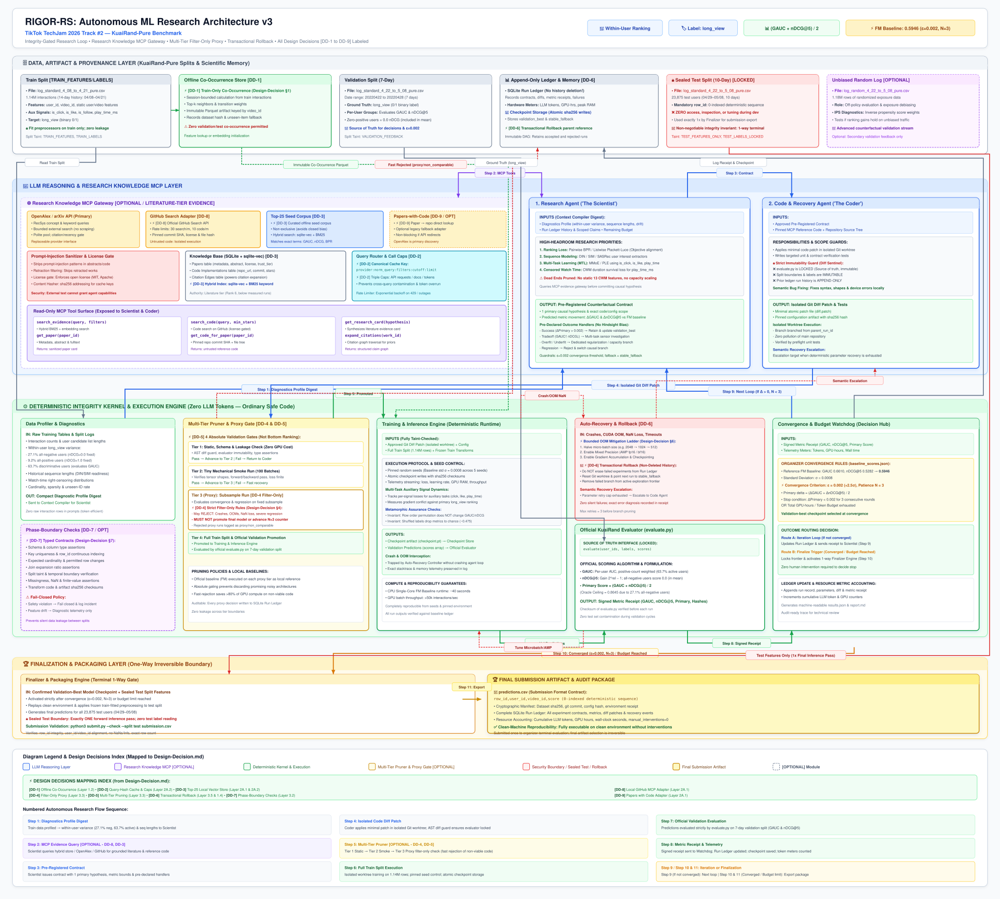
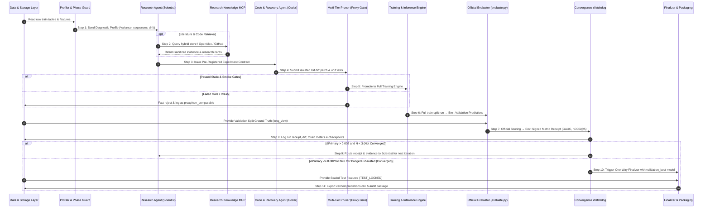

# RIGOR-RS: Autonomous ML Research Architecture v3 (KuaiRand-Pure)

**RIGOR-RS** stands for **Reproducible, Integrity-Gated, Outcome-Registered Research for Recommender Systems**. It is an autonomous ML research agent architecture designed for the **TikTok TechJam 2026 Track #2 Challenge** on the **KuaiRand-Pure** benchmark.

This document represents the official Architecture v3 specification, incorporating all new design decisions, the Research Knowledge MCP layer, multi-tier filter-only proxy pruning, transactional rollback mechanisms, and exact alignment with organizer problem constraints (`GAUC`, `nDCG@5`, `long_view` relevance label, and within-user ranking).

---

## 1. Core Architecture Diagram

The complete end-to-end architecture is illustrated below:



*High-resolution raster version available at:* [`docs/architecture/diagrams/ARCHITECTURE_v3_kuairand.png`](./diagrams/ARCHITECTURE_v3_kuairand.png)

---

## 2. Problem Statement & Invariant Alignment

### 2.1 Benchmark & Objective Formulation
- **Benchmark Dataset**: **KuaiRand-Pure** (Short-video feed dataset with user interactions, multi-signal feedback, and randomized exposures).
- **Ranking Task**: **Within-User Ranking (`用户内排序`)** — The model ranks each user's specific candidate video exposures in the evaluation set; no full-corpus retrieval is performed.
- **Positive Relevance Label**: **`long_view`** (raw binary column, 0/1).
- **Official Evaluation Metrics**:
  1. **`GAUC`**: Group AUC calculated strictly within-user and weighted by user positive count. Only evaluates users with $0 < \text{positives} < \text{exposures}$ (63.7% of test users).
  2. **`nDCG@5`**: Normalized Discounted Cumulative Gain with $2^{\text{rel}} - 1$ gain formulation. Users with zero positive items receive 0.0 and are **included** in the overall average (27.1% of test users are all-negative, 9.2% are all-positive).
  3. **Primary Composite Score**: Equal-weighted arithmetic mean:
     $$\text{Score}_{\text{primary}} = \frac{\text{GAUC} + \text{nDCG@5}}{2}$$
     $$\Delta(\text{Primary}) = \text{Score}_{\text{agent}}(\text{primary}) - \text{Score}_{\text{official\_baseline}}(\text{primary})$$

### 2.2 Official Baseline Ladder & Headroom Reference
All improvements must be evaluated against the organizer-provided Factorization Machine (`FM`) baseline on the test split:

| Model / Benchmark | GAUC | nDCG@5 | Primary Score | Notes |
|---|---|---|---|---|
| **Random (Lower Bound)** | 0.4996 | 0.4511 | 0.4753 | Sanity check for evaluation harness |
| **Item Popularity (Trivial)** | 0.6308 | 0.5121 | 0.5715 | Popularity prior |
| **FM (Official Baseline to Beat)** | **0.6610** | **0.5282** | **0.5946** | Target baseline ($\sigma = 0.0008$) |
| **Oracle Ceiling** | **1.0000** | **0.7289** | **0.8645** | Maximum possible score (due to 27.1% all-negative users) |

> ⚠️ **Key Headroom Insight**: The FM baseline has already captured **30.7%** of the total available headroom between Random (0.4753) and Oracle (0.8645). The true remaining headroom is **0.270**, not 0.405.

### 2.3 Official Convergence Policy
Loaded directly from `kuairand-starter-kit/baseline_scores.json`:
- **Improvement Threshold**: $\varepsilon = 0.002$ ($\approx 2.5\sigma$).
- **Patience**: $N = 3$ consecutive iterations.
- A research run terminates when the validation primary score fails to improve by more than $\varepsilon = 0.002$ for $N = 3$ consecutive rounds, or when compute/token budgets are exhausted. The **validation-best** artifact is frozen for final submission.

---

## 3. Incorporation of New Design Decisions

Architecture v3 operationalizes all design decisions from [`Design-Decision.md`](./Design-Decision.md):

### 3.1 Offline Item Co-Occurrence Store
- **Train-Only Computation**: Co-occurrence statistics are computed **strictly from training interactions** (`log_standard_4_08_to_4_21_pure.csv`), respecting chronological and session boundaries.
- **Immutable Storage**: Top-k transition neighbors and association weights are stored as an immutable Parquet artifact keyed by `video_id`.
- **Integrity Tracking**: Records dataset hash, session definitions, transform code hash, and fallback strategies for unseen items.
- **Leakage Prevention**: Zero exposure to validation or test logs.

### 3.2 Canonical Query-Hash Caching & Triple Call Caps
- **Canonical Cache Key**:
  ```text
  provider + normalized_query + filters + cutoff_date + result_limit
  ```
- **Triple Budget Caps**: Enforces strict separate limits on:
  1. Outbound API requests (preventing rate-limit lockouts).
  2. Retrieved documents per experiment.
  3. Total LLM input/output tokens.

### 3.3 Top-25 Local Vector Store (Curated Seed Corpus)
- **Non-Exclusive Design**: The curated 25 papers do not form a closed knowledge base (preventing premature bias toward specific models before diagnostics justify them).
- **Multi-Purpose Role**:
  1. Curated offline seed corpus.
  2. Outage fallback during network disruptions.
  3. High-priority retrieval collection (`trust_tier = curated`).
- **Hybrid Retrieval**: Combines semantic embeddings (`sqlite-vec`) with BM25 keyword matching for exact technical terms (`GAUC`, `nDCG@5`, `BPR`, `KuaiRand`, `long_view`).

### 3.4 Filter-Only Proxy Gate
- **Strict Rejection Role**: Proxy runs (on fast stratified subsamples) are **filter-only**. They may reject:
  - Code crashes, CUDA OOMs, or NaN loss.
  - Failure to learn beyond a fixed proxy baseline.
  - Extreme metric regressions exceeding pre-registered safety thresholds.
  - Run time or memory scaling that exceeds competition limits.
- **Non-Promotion Rule**: Proxy results **must never** promote a final architecture, advance the convergence counter ($N=3$), or be reported as official scores.
- **Traceability**: All rejected proxy runs are logged in the ledger as `proxy/non_comparable`.

### 3.5 Multi-Tier Pruning (Optional)
Implements 4 absolute sequential validation gates (never relative "bottom performer" pruning):
1. **Tier 1**: Static syntax, schema, leakage, and evaluator diff checks (zero GPU cost).
2. **Tier 2**: Tiny mechanical smoke run (100 batches, shape and forward-pass verification).
3. **Tier 3**: Medium filter-only proxy run (convergence and severe regression check).
4. **Tier 4**: Full train split execution and official validation evaluation.

### 3.6 Transactional Rollback & Non-Deleted History
- **Immutable History Invariant**: Failed runs and diffs are **never deleted or overwritten** in the SQLite Run Ledger.
- **Rollback Implementation**:
  - Isolated Git worktree per experiment.
  - Atomic checkpoint writes with sha256 checksums.
  - Automatic rollback of active branch pointer to `stable_fallback` upon failure.
  - Removal of failed branch from the active exploration frontier while preserving its full DAG node and telemetry in the ledger.
- **Bounded OOM Recovery Ladder**:
  $$\text{Halve Micro-Batch} \longrightarrow \text{AMP (fp16/bf16)} \longrightarrow \text{Gradient Accumulation} \longrightarrow \text{Gradient Checkpointing} \longrightarrow \text{Semantic Code Escalation}$$

### 3.7 Phase-Boundary Checks (Optional)
- **Typed Stage Contracts**: Enforces assertions before and after pipeline transitions:
  - Schema and type compatibility.
  - Continuous 0-indexed `row_id` uniqueness and identifier alignment.
  - Split taint and temporal exclusivity.
  - Finite values, missingness thresholds, and join expansion ratios.
- **Diagnostic Policy**: Feature distribution drift raises diagnostic telemetry rather than terminating runs, unless pre-declared safety bounds are breached.

### 3.8 Local GitHub MCP Adapter & OpenAlex Discovery
- **Local GitHub Adapter**: Small read-only MCP interface over official GitHub Search API respecting rate limits (30 search req/min, 10 code search req/min).
- **Code Provenance**: All retrieved code records license, commit SHA, file hash, and URL. External code is treated as untrusted and executed only inside isolated worktrees.
- **OpenAlex Primary Source**: OpenAlex serves as the primary literature provider; Papers-with-Code is marked as an optional/legacy fallback.

---

## 4. Layered System Architecture

The RIGOR-RS v3 architecture is partitioned into four decoupled layers:

### Layer 1: Data, Artifact & Provenance Layer
- **Train Split**: `log_standard_4_08_to_4_21_pure.csv` (1.14M rows, 14 days). Tainted as `TRAIN_FEATURES` and `TRAIN_LABELS`.
- **Offline Item Co-Occurrence Store**: Train-only session transition matrix stored as Parquet keyed by `video_id`.
- **Validation Split**: `log_standard_4_22_to_5_08_pure.csv` (7-day 04/22–04/28). Used solely for official validation feedback.
- **Unbiased Random Exposure Log (Optional)**: `log_random_4_22_to_5_08_pure.csv` (1.18M rows) for off-policy counterfactual validation.
- **Sealed Test Split**: `log_standard_4_22_to_5_08_pure.csv` (10-day 04/29–05/08, 23,875 users). Locked under `TEST_LABELS_LOCKED`.
- **Append-Only Run Ledger**: SQLite database recording all immutable contracts, metric receipts, code diffs, token counts, GPU hours, and failure recovery events.
- **Checkpoint & Frontier Store**: Validation-best model weights (`validation_best`), fallback checkpoints (`stable_fallback`), and frontier states.

### Layer 2: Research Knowledge MCP & LLM Reasoning Layer
- **Research Knowledge MCP Gateway (Optional / Literature Tier)**:
  - Adapters: OpenAlex API (primary), GitHub Search API (code discovery), Papers-with-Code (optional fallback), Curated Top-25 Seed Corpus.
  - Gateway Pipeline: Prompt-Injection Sanitizer & Retraction Gate $\to$ Knowledge Store (sqlite-vec + BM25) $\to$ Query Router with Canonical Caching & Call Caps $\to$ MCP Tool Interface (`search_evidence`, `get_paper`, `search_code`, `get_code_for_paper`, `get_research_card`).
- **Research Agent ('The Scientist')**:
  - Context: Diagnostics profile, ledger history, scoped claims, MCP research cards.
  - Outputs: Pre-registered counterfactual experiment contracts committing to 1 causal hypothesis, predicted $\Delta\text{GAUC}$ and $\Delta\text{nDCG@5}$, guardrails, and pre-declared branching actions.
- **Code & Recovery Agent ('The Coder')**:
  - Context: Approved contract, pinned MCP reference code, repository source tree, execution tracebacks.
  - Outputs: Minimal atomic Git diff patches and targeted unit tests inside isolated Git worktrees.

### Layer 3: Deterministic Integrity Kernel & Execution Engine
- **Data Profiler & Diagnostics**: Profiles within-user label variance, sequence lengths, watch-time right-censoring, sparsity, and temporal drift.
- **Phase-Boundary Guard (Optional)**: Validates stage contracts, row counts, `row_id` continuity, and split-taint boundaries.
- **Multi-Tier Pruner & Filter-Only Proxy (Optional)**: Filters out crashes, OOMs, and severe regressions without affecting convergence counts.
- **Training & Inference Engine**: Trains model in isolated worktree; emits atomic checkpoint and validation predictions.
- **Auto-Recovery & Transactional Rollback**: Executes OOM mitigation ladder or resets to `stable_fallback` with full ledger accounting.
- **Official KuaiRand Evaluator (`evaluate.py`)**: Computes GAUC and nDCG@5 per user; generates signed cryptographic metric receipts.
- **Convergence & Budget Watchdog**: Evaluates $\varepsilon = 0.002, N = 3$; routes execution to next iteration or triggers finalization.

### Layer 4: Finalization & Packaging Layer
- **Finalizer & Packaging Engine**: One-way irreversible transition. Replays winning run in a clean environment, applies frozen train-fitted transforms to sealed test features, generates `predictions.csv`, and executes `submit.py --check --split test`.
- **Final Submission Artifact**: Verified `predictions.csv` (`row_id,user_id,video_id,score`), complete reproducible audit log, and clean replay manifest.

---

## 5. High-Headroom Research Priorities vs Dead Ends

### ⚠️ Organizer-Tested Dead Ends (DO NOT REPEAT)
The organizers tested the following hypotheses and verified **zero measurable gain**:
1. **Adding all 13 CWM static features** (`+music_id`, `+video_type`, `+upload_type` + 6 user coarse buckets): Primary score **0.5940** vs 5-domain **0.5950** (flat / slight degradation). `user_id × video_id` interactions already capture almost all signal; coarse buckets are redundant.
2. **Scaling model capacity** ($k = 8 / 16 / 32$): Primary scores **0.5895 / 0.5902 / 0.5887** (flat). 1.14M interactions cannot support noisy capacity.
3. **Pure user-side 1st-order bias features**: **0.0 contribution** to score because ranking is evaluated strictly **within-user**. Features constant within a user do not alter relative candidate order.

### 🚀 High-Headroom Priority Roadmap
1. **Ranking Loss Function Alignment (Top Priority)**: Replace pointwise BCE logloss with pairwise objectives (BPR, Margin Ranking) and listwise objectives (Plackett-Luce / Softmax ranking over user candidate exposures).
2. **Sequential User History Modeling**: Model users' hundreds of chronological interactions in train logs using DIN, SIM, SASRec, or transformer interest extractors.
3. **Multi-Task Learning (MTL) with Auxiliary Signals**: Leverage `is_click`, `is_like`, `is_follow`, `is_comment`, `is_forward`, and `play_time_ms` via MMoE/PLE architectures to assist `long_view`.
4. **Watch-Time & Censored Regression Modeling**: Model right-censored watch time (`play_time_ms`) via duration survival losses (e.g. CWM survival loss).
5. **Feature Interaction Architectures**: Test DeepFM, DCNv2, xDeepFM, and AutoInt after ranking loss and sequence modeling.
6. **Temporal Dynamics & Distribution Drift**: Model `hourmin`, recency, and drift dynamics between train (`0408–0421`) and test (`0429–0508`).
7. **Unbiased Off-Policy Validation**: Validate on `log_random_4_22_to_5_08_pure.csv` (1.18M rows) to counter exposure bias.

---

## 6. Complete Research Flow Sequence



---

## 7. Verification & Compliance Checklist

- [x] **Official Baseline Reproduced**: FM reproduced at primary $0.5946$ ($\sigma=0.0008$).
- [x] **Correct Metrics & Relevance Label**: GAUC & nDCG@5 with binary `long_view` label.
- [x] **Within-User Ranking Alignment**: Ranking evaluated per user candidate exposure set.
- [x] **Split Taint Enforced**: Strict boundary between train, validation, and sealed test sets.
- [x] **Design Decisions Implemented**: Train-only co-occurrence, canonical query-hash caching, triple call caps, top-25 seed corpus, filter-only proxy, transactional rollback, phase-boundary checks, and local GitHub adapter.
- [x] **Non-Deleted History**: Full append-only SQLite ledger of all experiments, diffs, and recoveries.
- [x] **Submission Compliance**: Formatted as `row_id,user_id,video_id,score` and verified by `submit.py --check --split test`.
