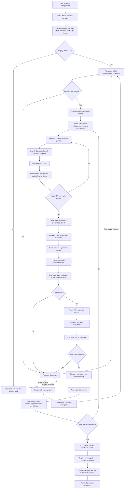

# RIGOR-RS: Final KuaiRand-Pure Architecture

**Version:** 3  
**Primary benchmark:** KuaiRand-Pure  
**Primary metrics:** NDCG@10 and Recall@50  
**Primary relevance label:** click

## 1. Purpose

RIGOR-RS is an autonomous machine-learning research system for recommender
systems. Its job is to reproduce the official KuaiRand-Pure baseline and then
run a controlled sequence of experiments that may improve the official
validation metrics.

The system must do more than generate code or try random model settings. It
must:

1. Understand the organizer's rules.
2. Protect the dataset splits and official evaluator.
3. Reproduce the official baseline.
4. Measure what is weak in the current pipeline.
5. Find relevant published research when needed.
6. Turn research claims into testable experiment plans.
7. Make a small, focused code change.
8. Train and evaluate with the official procedure.
9. Decide whether the result supports or rejects the idea.
10. Recover safely from expected failures.
11. Preserve every result, failure, repair, and resource cost.
12. Select the best valid validation artifact when the run ends.

The main distinguishing feature is the **Paper-to-Proof Engine**:

> The system discovers relevant research, checks whether the research applies
> to the current KuaiRand-Pure evidence, tests it with a registered experiment,
> and records whether the claim worked locally.

A paper is treated as useful prior knowledge, not as proof. Only a valid result
from the official evaluator can prove that a change helped this benchmark.

## 2. Plain-language definitions

This document uses a small number of technical terms:

- **Deterministic service:** ordinary code that follows fixed rules. Given the
  same inputs and state, it makes the same decision.
- **Artifact:** a saved output such as a dataset table, model checkpoint,
  prediction file, plot, configuration, or log.
- **Hash:** a digital fingerprint used to detect whether a file changed.
- **Experiment contract:** the experiment plan written and locked before code
  changes or training begin.
- **Evidence record:** a saved paper result, diagnostic, metric, or run result
  with its source and digital fingerprint.
- **Research card:** a short structured description of a paper's claim,
  assumptions, proposed change, expected result, and reasons it may fail.
- **Replication receipt:** the final comparison between what a research card
  predicted and what the KuaiRand-Pure experiment actually produced.
- **MCP:** Model Context Protocol, a standard way for an agent to call external
  tools. MCP is optional in this design; the underlying evidence service is
  required.

## 3. Core rules

The following rules cannot be overridden by an agent or user preference:

1. KuaiRand-Pure is the primary benchmark.
2. KuaiRand-1k and KuaiRand-27k remain disabled until KuaiRand-Pure is ready for
   final submission.
3. Only challenge-permitted data may contribute training examples or labels.
4. The organizer's split definitions, label definitions, baseline, evaluator,
   output format, and final instructions have the highest authority.
5. The official baseline must be reproduced before a novel experiment begins.
6. Model fitting uses only the training split.
7. Validation labels are used only through permitted validation evaluation.
8. Test labels are never available to development components.
9. Test results cannot select, reject, repair, or restart an experiment.
10. The official evaluator is the source of truth for NDCG@10 and Recall@50.
11. Every experiment has one main hypothesis, one clear parent, one focused
    change, a budget, success conditions, and a fallback.
12. The experiment plan is saved before code changes or training begin.
13. Every success, regression, crash, retry, repair, and manual action remains
    in append-only history.
14. Organizer-controlled values such as the official score, convergence
    threshold, patience, seeds, command, schema, and resource limits come from
    versioned configuration. The system does not invent them.
15. The final artifact is the best confirmed validation artifact, not simply
    the newest model.
16. Hidden-test evaluation is terminal. It cannot start a new research cycle.
17. Completed runs remain readable and replayable when the LLM or network is
    unavailable.

## 4. Architecture overview

RIGOR-RS has three main layers.

### 4.1 Scientific research layer

This layer decides what should be tested and why:

- Data and training profiler.
- Context compiler.
- OpenAlex Evidence Gateway.
- Research Agent.
- Research-card builder.
- Research-fit checker.
- Multi-task interference sensor.
- Experiment selector.
- Experiment-contract compiler.
- Result analyst.
- Replication-receipt writer.

This layer may propose actions, but it cannot bypass integrity checks or select
an invalid result.

### 4.2 Integrity and execution layer

This layer has final control over data use and execution:

- Challenge-contract loader.
- Authority resolver.
- Data-use label checker.
- Research Integrity Kernel.
- Isolated workspace manager.
- Trainer.
- Official evaluator wrapper.
- Resource monitor.
- Experiment ledger.
- Convergence controller.
- Finalizer.

### 4.3 Recovery layer

This layer handles failures:

- Failure-record builder.
- Deterministic Recovery Controller.
- Code and Recovery Agent.
- Repair checker.

Known and safe operational failures use fixed recovery procedures. Failures
requiring source-code reasoning go to the Code and Recovery Agent. Any failure
that may compromise the dataset, evaluator, or test boundary stops safely.

## 5. Complete logic flow



The important feedback loop is:

```text
measure a problem
    -> find relevant research
    -> check whether it applies
    -> register one experiment
    -> change real code
    -> train and officially evaluate
    -> record whether the claim worked
    -> use that evidence for the next decision
```

## 6. Challenge contract

The first system action converts organizer material and permitted user
preferences into a typed configuration. Organizer rules become protected
fields. User input can influence preferences but cannot change protected fields.

```yaml
challenge:
  id: organizer_supplied_identifier
  benchmark: kuairand_pure
  organizer_material_version: supplied_value

data:
  raw_uri: supplied_path_or_object_uri
  dataset_version: supplied_value
  expected_checksums: supplied_manifest
  split_definition: supplied_definition
  train_selector: supplied_selector
  validation_selector: supplied_selector
  test_selector: supplied_selector
  relevance_label: click

baseline:
  identifier: organizer_official_identifier
  source_uri: organizer_supplied_repository
  source_revision: pinned_commit_or_release
  environment: pinned_environment_artifact
  train_command: exact_command
  evaluate_command: exact_official_command
  expected_scores: organizer_supplied_or_null
  reproduction_tolerance: organizer_supplied_or_null

evaluation:
  evaluator_uri: organizer_supplied_path
  evaluator_hash: computed_hash
  metrics:
    - ndcg_at_10
    - recall_at_50
  composite_rule: organizer_supplied_rule
  submission_schema: organizer_supplied_schema

convergence:
  epsilon: organizer_supplied_value
  patience: organizer_supplied_value
  counting_policy: organizer_supplied_policy

budget:
  wall_clock_seconds: organizer_supplied_value
  gpu_hours: organizer_supplied_value
  llm_input_tokens: organizer_supplied_value
  llm_output_tokens: organizer_supplied_value
  max_experiments: organizer_supplied_value
  max_retries_per_failure: bounded_configured_value

user_preferences:
  objective_notes: permitted_text
  excluded_features: permitted_list
  resource_preference: permitted_value
```

If a required organizer field is missing, the affected phase waits or stops. The
system does not guess a replacement.

## 7. Data access and integrity

### 7.1 Data-use labels

Every dataset and derived artifact carries labels describing how it may be used:

| Label | Permitted use |
| --- | --- |
| `TRAIN_FEATURES` | Profiling, train-fitted transforms, and model fitting |
| `TRAIN_LABELS` | Model fitting and training diagnostics |
| `VALIDATION_FEATURES` | Validation prediction generation with frozen transforms |
| `VALIDATION_FEEDBACK` | Official validation evaluation and experiment decisions |
| `TEST_FEATURES_ONLY` | Final prediction generation after finalization |
| `TEST_LABELS_LOCKED` | No development component may read it |

A derived artifact inherits the strongest restriction from its parents. For
example, information created from validation labels cannot enter model fitting.
A training table with any test-related parent is rejected before execution.

### 7.2 Minimum access by component

| Component | Data access | Network access | Mutation rights |
| --- | --- | --- | --- |
| Profiler | Train and permitted validation data | None | New diagnostic artifacts |
| Research Agent | Summaries and selected run evidence | Evidence Gateway only | Experiment proposal |
| Evidence Gateway | No benchmark data | OpenAlex and approved fallback | Evidence cache only |
| Code Agent | Interfaces, selected source, and errors | Disabled by default | Current experiment workspace |
| Trainer | Training artifacts | None | Checkpoints and logs |
| Evaluator | Validation labels and predictions | None | Official metric receipt |
| Finalizer | Winning artifact and test features | Submission endpoint if required | Final package only |
| Report renderer | Redacted events and artifact metadata | None | Generated reports only |

External papers, repositories, and source comments are untrusted text. They
cannot grant permissions or alter the challenge contract.

## 8. Official baseline gate

The official baseline is a required gate.

1. Pin the exact organizer baseline revision and environment.
2. Save the baseline plan before execution.
3. Run component checks and a small, low-cost trial to confirm that the command,
   data loader, model, and evaluator connect correctly.
4. Train the official baseline using the fixed training split.
5. Generate validation predictions.
6. Run the exact official evaluator.
7. Save commands, configuration, seeds, logs, resources, predictions,
   checkpoint, code hash, evaluator hash, and metrics.
8. Compare observed scores with organizer expectations using the supplied
   tolerance.
9. Register the reproduced baseline as `B0` and as the stable fallback.

If reproduction fails, investigate in this order:

1. Environment or dependency mismatch.
2. Wrong dataset version or path.
3. Split mismatch or overlap.
4. Schema or column-order mismatch.
5. Label interpretation mismatch.
6. Preprocessing mismatch.
7. Seed or data-order mismatch.
8. Evaluator or output-format mismatch.

Novel experiments cannot begin until the baseline gate passes.

## 9. Deterministic diagnosis

After the baseline is reproduced, the profiler calculates evidence such as:

- Sample counts by split and by user.
- Click-positive rate by split.
- Users with no candidates or no clicked items.
- Null, malformed, duplicate, constant, and nearly constant fields.
- Feature types, category counts, frequency tails, sparsity, and unseen-ID rates.
- Train-to-validation changes in features and labels.
- User, item, category, and interaction coverage.
- Time ordering and possible leakage.
- Training and validation curves.
- Per-task losses when auxiliary KuaiRand feedback is used.
- NDCG@10 and Recall@50 behavior by useful user groups.
- Cold-item and unseen-ID behavior.
- Runtime, peak GPU memory, data-loading speed, and accelerator use.
- Calibration and log loss as supporting diagnostics, not replacement metrics.

Feature cleaning follows these rules:

1. The reproduced baseline remains unchanged.
2. A new transformation is an experiment, not an invisible cleanup.
3. Protected labels, user keys, item keys, split keys, and submission keys cannot
   be removed.
4. Category maps, missing-value rules, scalers, and feature statistics are fit
   on training data only.
5. Validation and test features receive the frozen training transformation.
6. Every derived table records its parents, schema fingerprint, row count,
   transformation code hash, and configuration hash.
7. Raw dataframe rows do not enter LLM prompts. The agent sees bounded summaries
   and approved examples only.
8. Diagnostics rerun only when an upstream artifact changes.

## 10. External research through the Evidence Gateway

### 10.1 Primary source: OpenAlex

RIGOR-RS uses the official OpenAlex API as its primary research source. OpenAlex
supports keyword search, semantic search, paper metadata, citations, related
works, open-access information, and full-text access where available.

Semantic search finds papers by meaning rather than only exact words. This lets
the system search for a measured mechanism, for example:

> Multi-task recommendation where click ranking improves but an auxiliary
> long-view task has opposing gradients and reduces NDCG@10.

Official references:

- [OpenAlex API](https://help.openalex.org/api/)
- [OpenAlex semantic search](https://help.openalex.org/api/semantic-search/)
- [OpenAlex works data](https://help.openalex.org/data/works/)
- [OpenAlex full-text access](https://help.openalex.org/access/fulltext/)

The official Semantic Scholar API may be used as an optional related-paper
fallback. It is not required for the training loop.

### 10.2 Gateway interface

```text
search_works(
    query,
    semantic,
    publication_cutoff,
    open_access_only,
    max_results
)

get_work(work_id)

expand_citations(
    work_ids,
    direction,
    max_results
)

get_fulltext(
    work_id,
    preferred_format
)

get_evidence_snapshot(snapshot_id)
```

The gateway can be called directly or exposed through MCP. MCP is only the tool
interface; the gateway's validation and cache rules remain the same.

### 10.3 Retrieval process

1. Start with a measured problem, not a broad request for the "best model."
2. Convert the problem into a focused search query.
3. Retrieve a bounded number of results.
4. Remove duplicates by DOI and OpenAlex ID.
5. Reject retracted works by default.
6. Rank results using topic match, recency when relevant, citation evidence,
   available implementation information, and similarity to the current task.
7. Retrieve full text only for the small final set when needed.
8. Save the exact provider response, retrieval time, query, source IDs, license,
   and hashes.
9. Reuse the saved snapshot during replay instead of silently fetching newer
   content.

### 10.4 Evidence restrictions

- Paper text is untrusted input.
- External material may inform a hypothesis but cannot change protected rules.
- Citation count affects discovery, not truth.
- Retracted work is excluded unless the system is explicitly studying the
  retraction.
- Full-text licenses are checked before content is stored or reused.
- External datasets are not imported into model training.
- Code from a paper is pinned to an exact revision, license-checked, reviewed,
  adapted in an isolated workspace, and tested.
- Trainer and evaluator processes have no research-network access.

This is not a manually curated paper bank. It is a query-driven evidence cache
built automatically from current research questions.

## 11. Paper-to-Proof Engine

### 11.1 Research question

The Research Agent receives:

- Protected challenge rules.
- Current data and training diagnostics.
- Current best model and stable fallback.
- Closely related successful, rejected, and failed experiments.
- Remaining GPU, time, and token budget.
- Relevant saved research evidence.

It produces one focused question and one main causal hypothesis. For example:

> The long-view auxiliary task is harming click ranking because its updates
> often oppose the click task's updates in shared model layers.

### 11.2 Research cards

Retrieved papers are converted into short structured cards:

```yaml
research_card_id: immutable_id
sources:
  - evidence_id: sha256:...
    openalex_id: W...
    doi: ...

claim:
  statement: bounded_research_claim
  mechanism: why_the_change_should_work

preconditions:
  - condition_that_should_exist_locally

proposed_intervention:
  component: model | feature | objective | training
  description: one_focused_change

expected_primary_effect:
  ndcg_at_10: up | down | unchanged | uncertain
  recall_at_50: up | down | unchanged | uncertain

expected_diagnostics:
  named_diagnostic: expected_direction

falsifiers:
  - observation_that_would_reject_the_claim

implementation_surface:
  allowed_files: []

estimated_cost:
  gpu_hours: value
  implementation_risk: low | medium | high

applicability:
  matched_conditions: []
  missing_conditions: []

authority: literature_prior
```

The Research Agent does not pass whole papers to the Code Agent. The card keeps
only the information needed for a decision, along with links to the original
evidence.

### 11.3 Research-fit checker

A popular paper is not automatically a good experiment. The fit checker asks:

1. Does the measured KuaiRand-Pure problem match the paper's problem?
2. Are the paper's required signals and model conditions present?
3. Does the proposed change respect the organizer rules?
4. Can it be implemented as one focused experiment?
5. Can it fit the remaining resource budget?
6. Has an equivalent experiment already been tried?
7. Is there a cheaper check that could reject the idea first?

The checker scores candidates using:

```text
candidate value =
    expected information or metric benefit
    x chance that the experiment will execute correctly
    x local research fit
    x useful novelty
    ----------------------------------------------------
    GPU cost + token cost + implementation risk + added complexity
```

This ranking helps choose among valid ideas. It never replaces the official
metric objective.

### 11.4 Cheapest useful precondition check

Before a full training run, the system performs the least expensive check that
could show that the idea does not apply.

| Proposed change | Required local evidence |
| --- | --- |
| MMoE or PLE | Measured task interference or clearly different task behavior |
| Rare-category handling | Measured category-frequency tail or unseen-ID problem |
| Larger model | Evidence of underfitting rather than overfitting |
| Different ranking loss | Per-user ranking errors consistent with the proposed loss |
| New auxiliary task | Coverage plus evidence that it helps the click task |
| Data-loader rewrite | Measured input bottleneck |
| Exposure correction | Permitted and measurable exposure mechanism |

These checks decide whether an experiment is worth running. They cannot be
reported as an official improvement.

## 12. KuaiRand multi-task interference sensor

KuaiRand contains several user-feedback signals, including click, like, follow,
and long view. Click remains the primary relevance label. Auxiliary signals may
help, but they may also push shared model weights in a direction that hurts
click ranking.

When a multi-task model is used, the sensor records:

- Per-task training and validation loss.
- Speed of convergence for each task.
- Effect of each auxiliary task on NDCG@10 and Recall@50.
- Where affordable, the direction of task gradients in shared layers.
- The fraction of sampled steps where an auxiliary task opposes the click task.

A negative gradient relationship means that two tasks are often trying to
change shared weights in opposing directions. It is evidence to investigate,
not automatic proof that a task must be removed.

Example record:

```yaml
primary_task: click
auxiliary_tasks:
  long_view:
    mean_gradient_relationship: -0.18
    opposing_step_fraction: 0.64
    validation_loss_trend: improving
    ndcg_relationship: negative
    recall_relationship: positive

  like:
    mean_gradient_relationship: 0.11
    opposing_step_fraction: 0.31
    validation_loss_trend: improving
    ndcg_relationship: positive
    recall_relationship: positive
```

The Research Agent may then test one change at a time:

- Change one auxiliary-task weight.
- Remove one harmful auxiliary task.
- Separate part of one task tower.
- Test MMoE.
- Test PLE.
- Test a method that prevents opposing gradients from changing shared weights.

A complex multi-task architecture is selected only when the measured evidence
supports it.

## 13. Experiment contract

Before code or training begins, the system saves and locks:

```yaml
experiment_id: immutable_id
parent_run_id: baseline_or_prior_run

primary_hypothesis: specific_causal_statement

supporting_evidence:
  run_ids: []
  diagnostic_artifacts: []
  research_cards: []

planned_change:
  component: data | feature | model | objective | training
  description: one_focused_change
  allowed_files: []
  prohibited_files:
    - official_evaluator
    - split_definition
    - previous_run_history

expected_outcomes:
  success:
    metric_direction: configured_expectation
    diagnostic_direction: configured_expectation
    action: retain_or_confirm

  metric_tradeoff:
    condition: one_metric_up_other_down
    action: inspect_composite_and_task_evidence

  overfit:
    condition: training_improves_validation_declines
    action: reject_and_form_one_new_hypothesis

  underfit:
    condition: training_and_validation_remain_weak
    action: reject_and_form_one_new_hypothesis

  no_clear_signal:
    condition: delta_not_above_required_threshold
    action: reject_or_confirm_if_policy_allows

falsifiers: []

success_criterion:
  comparator: parent_and_official_baseline
  epsilon: from_challenge_config
  metric_guardrails: from_challenge_config_or_null

confirmation_policy: configured_seed_or_uncertainty_rule

budget:
  max_gpu_hours: value
  max_wall_seconds: value
  max_input_tokens: value
  max_output_tokens: value

fallback:
  run_id: stable_parent
  recovery_limit: value
```

Writing expectations before seeing the result prevents the system from changing
its story after training.

## 14. Code change and pre-training checks

1. Create an isolated work directory from the parent revision.
2. Give the Code Agent only the approved contract and relevant files.
3. Make the smallest code change that tests the hypothesis.
4. Reject changes outside the allowed file list unless a new contract is saved.
5. Save the exact code difference before training.
6. Check code syntax and types where supported.
7. Run tests for the changed component.
8. Check data schema, split separation, data-use labels, evaluator hash, and
   submission format.
9. Check that row order and stable identifiers are handled according to the
   official evaluator.
10. Run a small, low-cost trial when the change affects model structure, data
    shape, or training behavior.
11. Confirm that a full run can fit the remaining budget.
12. Start full training only after all required checks pass.

The small trial proves that the pipeline works mechanically. Its metrics are not
used as evidence of final improvement.

## 15. Training and official validation

1. Set and record all random seeds.
2. Load training-authorized artifacts only.
3. Record batch size, effective batch size, precision, optimizer, scheduler,
   learning rate, task weights, epochs, stopping rule, and checkpoint interval.
4. Stream logs and structured resource readings.
5. Save checkpoints atomically and attach hashes.
6. Record GPU use, peak memory, elapsed accelerator time, wall time, and
   data-loading speed.
7. Generate validation predictions using the frozen training transformation.
8. Validate prediction count, keys, types, missing values, and permitted value
   range.
9. Run the exact official evaluator.
10. Preserve raw evaluator output.
11. Create a metric receipt linking evaluator and prediction hashes.
12. Calculate supporting diagnostics without replacing official metrics.

## 16. Result comparison and decisions

For each run, compare the official validation metrics with both the reproduced
baseline and the selected parent.

```text
delta_ndcg = current NDCG@10 - comparator NDCG@10
delta_recall = current Recall@50 - comparator Recall@50
composite_delta = (delta_ndcg + delta_recall) / 2
```

Absolute differences are used, not relative percentages.

| Observed result | Meaning | Action |
| --- | --- | --- |
| Evaluator output is invalid | No valid scientific result exists | Repair input or wrapper; otherwise fail run |
| Both metrics improve above the required threshold | Strong candidate | Confirm if required, then retain |
| One improves and the other is unchanged | Possible useful candidate | Apply composite rule and configured guardrails |
| One improves and the other declines | Metric tradeoff | Preserve result and inspect task evidence |
| Positive change is below the required threshold | No counted improvement | Reject or confirm only if allowed |
| Change is within known noise | Unconfirmed | Confirm only when the value of more evidence justifies the cost |
| Both metrics decline | Hypothesis rejected | Preserve negative result and choose another branch |
| Training improves while validation declines | Overfitting pattern | Do not promote; form one focused follow-up |
| Training and validation remain weak | Underfitting or optimization problem | Form one focused follow-up |
| Runtime or memory increases without benefit | Unhelpful complexity | Reject |
| Equivalent configuration already exists | No new evidence | Skip training and return prior result |
| Evaluator, data, or config changed | Result is not directly comparable | Keep it in a separate comparison group |

The experiment list tracks:

- `validation_best`: best confirmed comparable validation artifact.
- `stable_fallback`: last reproducible valid parent.
- `pending_confirmation`: promising result that may be noise.
- `rejected`: valid negative experiments.
- `failed`: invalid executions and recovery records.
- `blocked`: integrity, duplication, or budget violations.
- `next_candidates`: ranked focused hypotheses.

## 17. Replication receipt

After official validation, the Paper-to-Proof Engine records whether the
research claim was supported locally:

```yaml
replication_id: immutable_id
research_card_id: immutable_id
experiment_id: immutable_id

scope:
  benchmark: kuairand_pure
  dataset_hash: sha256
  split_hash: sha256
  code_hash: sha256
  config_hash: sha256
  evaluator_hash: sha256
  seeds: []

research_prediction:
  ndcg_at_10: up
  recall_at_50: neutral_or_up
  named_diagnostic: expected_direction

observed:
  ndcg_at_10_delta: value
  recall_at_50_delta: value
  composite_delta: value
  diagnostic_changes: {}

outcome: supported | contradicted | ambiguous
confidence: configured_value

resource_cost:
  gpu_hours: value
  wall_clock_seconds: value
  llm_input_tokens: value
  llm_output_tokens: value
```

A paper claim starts as `literature_prior`. A supported local result becomes a
measured claim within its exact scope. A contradicted claim remains visible so
the system does not repeat the same idea without new evidence.

## 18. Recovery Controller

### 18.1 Purpose

The Recovery Controller does not try to understand every possible error. It:

1. Captures a structured failure record.
2. Protects data, artifacts, and the stable parent.
3. Applies a fixed procedure when the failure and safe response are known.
4. Sends source-code problems to the Code and Recovery Agent.
5. Stops safely when integrity may be at risk.

### 18.2 Failure record

```yaml
failure_id: immutable_id
run_id: immutable_id
attempt_id: immutable_id
stage: contract | code | checks | train | predict | evaluate | finalize
component: data | loader | model | optimizer | evaluator_wrapper | environment
exception_type: value
exit_code: value_or_null
message_digest: value
traceback_artifact: path_or_null
last_heartbeat: timestamp_or_null

gpu_memory:
  allocated_mb: value_or_null
  reserved_mb: value_or_null
  total_mb: value_or_null

checkpoint:
  latest_valid: path_or_null
  hash_verified: true_or_false

schema_difference: artifact_or_null
integrity_flags: []
remaining_budget: {}
repeated_signature_count: integer

classification:
  failure_class: value
  confidence: exact | strong | unknown
```

Classification uses exception types, process status, heartbeat, GPU readings,
schema differences, hashes, and test results. Text matching is a fallback, not
the main detector.

### 18.3 Route one: stop for integrity failures

These failures are never repaired by generated code:

| Failure | Action |
| --- | --- |
| Missing organizer-controlled field | Block until supplied |
| Dataset checksum mismatch | Restore verified copy or stop |
| Split overlap or unresolved leakage | Stop |
| Test-label access attempt | Deny, record incident, and block run |
| Evaluator hash changed | Stop evaluation |
| Official baseline revision mismatch | Restore pinned revision or stop |
| Unauthorized patch scope | Revert patch; block after bounded recurrence |
| Budget or finalization violation | Stop according to policy |
| Ambiguous label or split meaning | Stop rather than guess |

### 18.4 Route two: fixed operational recovery

| Failure | Fixed recovery |
| --- | --- |
| OpenAlex or LLM request is rate-limited | Use cache or retry with increasing delays |
| Evidence provider is unavailable | Continue from saved evidence or pause planning |
| LLM is unavailable | Let current deterministic work finish; pause new planning |
| Worker or process is interrupted | Resume from latest valid checkpoint |
| Checkpoint is corrupt | Restore previous hash-valid checkpoint |
| Disk is nearly full | Remove only reproducible cache files |
| Temporary file or object-store read error | Retry within configured limit |
| Data loader stops making progress | Restart from checkpoint with approved safer worker settings |
| Evaluator process is interrupted | Rerun exact evaluator on unchanged predictions |
| Duplicate experiment is detected | Return prior evidence and skip training |
| Budget ends during training | Save recoverable state and retain prior best artifact |

### 18.5 Pre-approved setting recovery

These procedures may run automatically only when the experiment contract allows
them because they change execution settings.

#### GPU out-of-memory procedure

1. Stop the failed process and preserve logs.
2. Reduce the number of examples processed at once.
3. Increase gradient accumulation to preserve the effective batch size.
4. Resume from the latest valid checkpoint.
5. Use already-supported activation checkpointing only if approved.
6. Escalate if memory failure continues.

Mixed precision or a model-architecture change is not enabled silently.

#### Non-finite or diverging loss procedure

1. Stop at the first non-finite value.
2. Save the failing batch reference and numeric readings where policy permits.
3. Validate label and input ranges.
4. Restore the last finite checkpoint.
5. Use a pre-approved precision fallback if one exists.
6. Retry once within the configured limit.
7. Send repeated failures to the Code and Recovery Agent.

A learning-rate, objective, or normalization change becomes a new recorded
branch rather than an invisible retry.

#### Timeout procedure

1. Determine whether work is progressing or has stopped.
2. Estimate whether completion fits the remaining budget.
3. Resume once from a valid checkpoint when allowed.
4. Otherwise stop the run cleanly.

### 18.6 Route three: Code and Recovery Agent

The following errors require source-code reasoning:

- Syntax, import, and type errors caused by the experiment patch.
- Tensor shape, data type, device, or broadcasting errors.
- Dependency API incompatibility.
- Tests failing because of changed code.
- Schema mismatch requiring a clear adapter.
- Broken feature joins.
- Prediction key or order bugs.
- Custom objective producing non-finite values after the fixed procedure.
- Repeated data-loader deadlocks indicating an implementation bug.
- Memory failure requiring implementation changes.
- Evaluator-wrapper input failures. The evaluator itself remains unchanged.
- Reproduction mismatch caused by data ordering or random-state handling.
- Unknown exceptions inside experiment-owned code.

The agent receives only the failure record, experiment contract, failing patch,
relevant files, and relevant tests. It has a bounded number of attempts.

After a repair, the Integrity Kernel reruns code checks, component tests, data
contracts, evaluator checks, and the small trial before returning to the failed
stage.

### 18.7 Scientific outcomes are not recovery errors

The following go to the Research Agent, not the Code Agent:

- NDCG@10 or Recall@50 regression.
- One metric improves while the other declines.
- Improvement is within noise.
- Overfitting or underfitting.
- No useful signal.
- Higher cost without metric benefit.
- Auxiliary-task interference.

These are valid results and must remain in experiment history.

### 18.8 Unknown failures

```text
if data integrity, evaluator integrity, or test isolation may be affected:
    stop safely
else if an exact approved recovery procedure exists:
    run one bounded recovery attempt
else if the error is inside experiment-owned code:
    request an isolated Code and Recovery Agent repair
else:
    isolate the failed run
    preserve all evidence
    retain the stable parent
    choose another valid branch or stop
```

The Code Agent is never asked simply to "make the run pass." Every repair has
allowed files, protected rules, required checks, and an attempt limit.

## 19. Convergence and stopping

After every valid comparable result, deterministic code updates the
organizer-defined improvement counter.

The research loop stops when any configured condition becomes true:

1. Validation improvement does not exceed the organizer threshold for the
   organizer-defined number of iterations.
2. The next safe experiment cannot fit the remaining GPU budget.
3. The next safe experiment cannot fit the remaining wall-clock budget.
4. The LLM token budget is exhausted, so no new planning call is allowed.
5. The maximum experiment count is reached.
6. No safe, non-duplicate, evidence-supported hypothesis remains.
7. Baseline integrity cannot be established.
8. An authorized stop is issued.

Failed experiments and recoveries still count toward resource use. Their effect
on the organizer's convergence counter comes from configuration rather than an
assumption in code.

If no experiment improves on the official baseline, the system reports that
honestly and retains the best valid artifact allowed by the final-selection
rule.

## 20. One-way finalization

1. Lock the experiment list.
2. Select the confirmed validation-best comparable artifact.
3. Write a final receipt containing run, data, transformation, code,
   configuration, checkpoint, prediction, evaluator, environment, and resource
   hashes.
4. Replay the winning path in a clean environment.
5. Repair only packaging or reproducibility defects at this point.
6. Apply the frozen training-fitted transformation to test features.
7. Generate predictions in the official schema.
8. Validate identifiers and schema without reading test labels.
9. Create the final submission artifact.
10. Perform the organizer's terminal evaluation once.
11. Do not use the hidden result to start another experiment.
12. Generate final reports from the append-only ledger.

Unless explicitly permitted by the organizer, the system does not retrain on
training plus validation after model selection.

## 21. Storage and scientific memory

### 21.1 Storage choice

For a judge-friendly single-machine system:

- Use SQLite for run metadata and decision history.
- Use normal immutable files for configurations, logs, patches, predictions,
  checkpoints, and diagnostic outputs.
- Use Parquet or the official baseline format for derived tables.
- Keep raw restricted data outside Git.
- Store large artifacts locally or in S3/MinIO when multiple workers require it.
- Do not store large dataframes inside a graph database.

### 21.2 Artifact record

```yaml
artifact_id: sha256:content_hash
kind: raw_dataset | derived_table | checkpoint | predictions | plot | log
uri: path_or_object_uri
parents: []
dataset_version: value
data_use_labels: []
schema_fingerprint: sha256:...
row_count: integer
column_manifest: path
transform_code_hash: sha256:...
config_hash: sha256:...
created_by_run: run_id
created_at: timestamp
```

### 21.3 Main records

Suggested SQLite tables:

```text
sessions
runs
run_events
experiment_contracts
metrics
resource_usage
artifacts
artifact_parents
failures
recoveries
external_evidence
research_cards
research_claims
claim_evidence
replication_receipts
experiment_candidates
manual_interventions
finalization_receipts
```

### 21.4 Claim rules

A scientific claim always includes its scope:

- Benchmark and dataset hash.
- Split-definition hash.
- Pipeline, model, code, and configuration hashes.
- Evaluator hash.
- Seed set.
- Supporting run IDs.
- Source authority: organizer, measured, replicated, literature, or agent.
- Status: supported, contradicted, disputed, or replaced.

Resolution rules:

1. Compare claims only when their scopes are compatible.
2. Organizer rules beat every lower-authority claim.
3. Official-evaluator measurements beat interpretations.
4. Repeated evidence is stronger than one run.
5. A newer result does not automatically replace an older result from a
   different configuration.
6. Contradictions remain visible and may become useful follow-up experiments.
7. Numeric metrics are compared by deterministic code, never selected by an
   LLM.

## 22. Run ledger

Every experiment record includes:

```yaml
run_id: unique_immutable_identifier
parent_run_id: baseline_or_previous_experiment
status: planned | running | succeeded | failed | rejected | accepted
stage: contract | code | checks | train | evaluate | analyze | finalize
benchmark: kuairand_pure
split_definition: exact_partition_and_version
split_definition_hash: sha256
seed: integer_or_list
hypothesis: bounded_statement
rationale: observed_evidence_or_literature
planned_change: concise_description
experiment_contract: immutable_path
research_cards: []
code_diff: immutable_patch_or_commit
code_hash: sha256
commands:
  train: exact_command
  evaluate: exact_official_command
config_artifact: immutable_path
config_hash: sha256
baseline_reference:
  identifier: official_identifier
  observed_run_id: baseline_run_id
  observed_metrics: {}
metrics:
  ndcg_at_10: number_or_null
  recall_at_50: number_or_null
  composite_validation_score: number_or_null
  delta_vs_parent: number_or_null
  delta_vs_official_baseline: number_or_null
diagnostics:
  values: {}
  validity_flags: []
  uncertainty: {}
resources:
  llm_input_tokens: integer
  llm_output_tokens: integer
  gpu_hours: number
  wall_clock_seconds: number
  peak_gpu_memory_mb: number_or_null
  retry_count: integer
artifacts:
  checkpoint: path_or_null
  predictions: path_or_null
  stdout_log: path
  stderr_log: path_or_null
  evaluator_receipt: path_or_null
error_recovery:
  error: string_or_null
  diagnosis: string_or_null
  action: string_or_null
  result: string_or_null
  attempts: []
decision: retain | reject | retry | branch | stop
replication_receipt: path_or_null
next_hypothesis: string_or_null
manual_intervention_count: integer
environment_receipt: path
created_at: timestamp
finalized_at: timestamp_or_null
```

Rules:

- Save the plan before execution.
- Append results after execution; do not rewrite old events.
- Record corrections as new events referencing the old event.
- A run without a valid official evaluator receipt cannot be accepted.
- Token and GPU totals come from provider and process readings.
- Manual edits, decisions, command corrections, restarts, and recoveries increase
  the intervention counter.

## 23. Token and compute efficiency

The system sends only relevant context to each agent call:

- Challenge-contract summary.
- Current diagnostic summary.
- Current parent and best-artifact summary.
- A small number of closely related prior experiments.
- Relevant research cards.
- Files or errors needed for the current task.
- Remaining resource budget.

Efficiency rules:

1. Limit tokens per role and experiment.
2. Cache prompts, responses, and external evidence by hash.
3. Do not send full dataframes, full logs, or complete run history to an LLM.
4. Compare metrics and generate reports with normal code.
5. Search external research only for a new, focused question.
6. Reject invalid ideas with contract checks before full training.
7. Use a small trial only to validate mechanics or reject an extreme idea.
8. Confirm a near-noise result only when the expected information justifies the
   cost.
9. Keep KuaiRand-1k and KuaiRand-27k disabled until KuaiRand-Pure is ready.
10. Reject added complexity that has no measured benefit.

Judge-facing efficiency measures:

- Time to first valid official baseline.
- Composite improvement per GPU-hour.
- Composite improvement per 100,000 LLM tokens.
- Percentage of experiments reaching valid official evaluation.
- Recovery success rate and average recovery attempts.
- Duplicate experiments avoided.
- Manual intervention count.
- Clean replay success rate.
- Peak GPU memory, wall time, and data-loading speed.

## 24. Required repository structure

```text
README.md
AGENTS.md
configs/
  challenge/
    kuairand_pure.yaml
    kuairand_1k.yaml              # disabled initially
    kuairand_27k.yaml             # disabled initially
  baseline/
  experiments/
  budgets/
data/
  README.md
  manifests/
docs/
  architecture/
    ARCHITECTURE_v3_kuairand.md
    diagrams/
src/
  contract/
  integrity/
  data/
  features/
  models/
  training/
  evaluation/
  evidence/
  research/
  agents/
  orchestration/
  recovery/
  ledger/
  reporting/
scripts/
  validate_environment.py
  reproduce_baseline.py
  run_agent.py
  evaluate_official.py
  create_submission.py
  replay_run.py
runs/
  <run_id>/
    plan.yaml
    result.yaml
    metrics.json
    research_cards/
    replication_receipt.yaml
    diff.patch
    stdout.log
    stderr.log
    report.md
artifacts/
tests/
  unit/
  contracts/
  integration/
  evaluator/
  recovery/
  reproducibility/
Dockerfile
requirements.lock
```

Restricted data, credentials, large checkpoints, and generated caches are not
committed to Git. Lightweight run records, configurations, and code differences
remain versioned where permitted.

## 25. Required command-line interface

The completed system should provide non-interactive commands equivalent to:

```text
python scripts/validate_environment.py --config configs/challenge/kuairand_pure.yaml

python scripts/reproduce_baseline.py --config configs/challenge/kuairand_pure.yaml

python scripts/run_agent.py --config configs/challenge/kuairand_pure.yaml

python scripts/evaluate_official.py --run-id <run_id>

python scripts/replay_run.py --run-id <run_id>

python scripts/create_submission.py --run-id <validation_best_run_id>
```

Each command returns a non-zero exit code on failure and writes structured logs.
No undocumented local path, UI action, or human memory is required.

## 26. Required checks

### Data and integrity checks

- Dataset checksums and expected files.
- Split separation and time boundaries.
- Label definition and protected keys.
- Training-only transform fitting.
- Data-use label propagation.
- Test-label denial.
- Submission schema and stable identifiers.

### Evaluator checks

- Official evaluator hash remains unchanged.
- Stable row reordering does not change results when the official format is
  key-based.
- Missing or duplicate prediction identifiers are rejected.
- Invalid prediction values and non-finite values are rejected.
- Metrics are calculated over the exact candidate sets required by the official
  evaluator.
- Raw evaluator output and parsed receipt agree.

### Recovery checks

Use a separate, non-scored test harness to introduce controlled failures:

- Missing column.
- Syntax error.
- Simulated GPU memory failure.
- Temporary process interruption.
- Non-finite loss.
- Corrupt checkpoint.
- Evidence API rate limit.
- Unknown error.

The harness verifies routing and history records. These controlled failures are
never presented as real competition-run failures.

### Reproducibility checks

- Same environment, code, data, configuration, and seed can replay the winning
  path within the configured tolerance.
- Artifact hashes match the final receipt.
- The selected artifact is the confirmed validation-best artifact.
- Test information has no path back into experiment selection.

## 27. Judge-facing demonstration

A clear demonstration should show one end-to-end decision:

1. The official baseline receipt.
2. A measured KuaiRand-Pure problem.
3. The focused research question created from that problem.
4. OpenAlex search results with provenance.
5. A research card and its local fit check.
6. The locked experiment contract with predicted outcomes.
7. The focused code change.
8. Training and official evaluation.
9. The replication receipt showing supported, contradicted, or ambiguous
   evidence.
10. The experiment-list update and next decision.
11. One controlled recovery example from the non-scored harness.
12. The final receipt linking the selected model to its exact evidence and
    artifacts.

The demonstration should make clear that the system is not blindly searching
models. It is carrying out a traceable research process.

## 28. Why this architecture stands out

RIGOR-RS is not distinguished merely by having multiple agents. Its advantage
comes from connecting four ideas into one working loop:

1. **On-demand research discovery:** OpenAlex supplies current academic and
   industry-affiliated papers without a manually curated bank.
2. **Local research-fit checking:** the system tests whether a paper's
   assumptions match the measured KuaiRand-Pure problem before spending a full
   training run.
3. **Paper-to-Proof records:** every research claim is connected to a locked
   prediction, real code change, official metric receipt, and local replication
   result.
4. **Safe mixed recovery:** fixed procedures handle known operational failures;
   the Code and Recovery Agent handles bounded source-code failures; integrity
   uncertainty stops safely.

The result is an autonomous research system that can answer:

- What problem did it observe?
- Why did it select this research?
- Why should the research apply here?
- What did it predict before training?
- What code changed?
- What did the official evaluator report?
- Did the research claim hold on KuaiRand-Pure?
- How much did the evidence cost?
- Why was the result retained or rejected?

That is stronger than an LLM that repeatedly proposes models or a fixed engine
that only searches configuration values.

## 29. Final submission checklist

- [ ] KuaiRand-Pure runs end to end from documented commands.
- [ ] The official baseline is reproduced and recorded.
- [ ] Data splits and test-label access are enforced by code.
- [ ] NDCG@10 and Recall@50 come from the official evaluator.
- [ ] Every experiment has one hypothesis, locked plan, code difference,
      metrics, resources, and decision.
- [ ] External research has source IDs, retrieval time, license, and hashes.
- [ ] Literature-derived experiments include a research card and replication
      receipt.
- [ ] Successful and failed recoveries remain in append-only history.
- [ ] Manual interventions are counted.
- [ ] Total LLM tokens, GPU-hours, and wall time are recorded.
- [ ] The final artifact is the confirmed validation-best artifact.
- [ ] The winning path can be replayed in a clean environment.
- [ ] Predictions match the official submission format.
- [ ] Hidden-test evaluation cannot feed back into research.
- [ ] KuaiRand-1k and KuaiRand-27k remain disabled until KuaiRand-Pure is ready.
